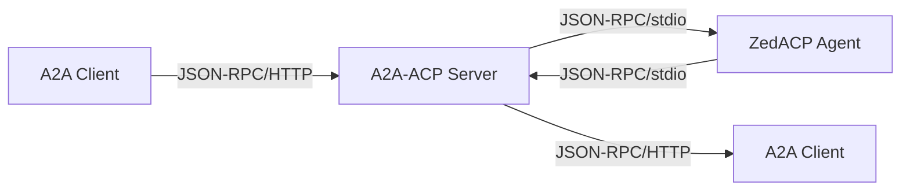

# A2A-ACP: Native A2A Protocol Server

**A2A-ACP** is a **native A2A protocol server** that exposes ZedACP agents via the modern **Agent-to-Agent (A2A) protocol** with JSON-RPC 2.0 over HTTP.

A complete implementation of the A2A v0.3.0 specification that bridges ZedACP agents to modern A2A clients.

### Key Features
- **A2A Protocol Compliance**: Full implementation of A2A v0.3.0 specification
- **ZedACP Integration**: Seamless bridge to existing ZedACP agents
- **Task Management**: Native A2A task and context lifecycle
- **Interactive Conversations**: Input-required workflows for multi-turn agent interactions
- **Agent Cards**: Dynamic generation of A2A AgentCard manifests
- **Streaming Support**: Real-time message streaming with Server-Sent Events
- **Type Safety**: Complete Pydantic models with validation

```bash
# A2A JSON-RPC request
curl -X POST http://localhost:8001/ \
  -H "Content-Type: application/json" \
  -d '{
    "jsonrpc": "2.0",
    "method": "message/send",
    "id": "req_001",
    "params": {
      "message": {
        "role": "user",
        "parts": [{"kind": "text", "text": "Hello A2A!"}],
        "messageId": "msg_123"
      },
      "metadata": {"agent_name": "codex-acp"}
    }
  }'
```


A2A-ACP supports **persistent contexts with conversational memory** across multiple tasks, providing a full-featured **stateful agent platform**:

- 🎯 **Context Persistence**: Maintain conversation context across multiple tasks
- 💾 **Message History**: Store and retrieve conversation history via A2A API
- 🔄 **ZedACP Integration**: Leverage native ZedACP session persistence capabilities
- 🏗️ **Context Management**: Complete lifecycle management with cleanup and monitoring
- 💬 **Interactive Conversations**: Support for input-required workflows where agents can pause and request user clarification

```bash
# Send initial message (creates new context)
curl -X POST http://localhost:8001/ \
  -H "Content-Type: application/json" \
  -d '{
    "jsonrpc": "2.0",
    "method": "message/send",
    "id": "msg_001",
    "params": {
      "message": {
        "role": "user",
        "parts": [{"kind": "text", "text": "Remember: My name is Alice"}],
        "messageId": "msg_001"
      },
      "metadata": {"agent_name": "codex-acp"}
    }
  }'

# Response includes contextId for continuation:
# {
#   "jsonrpc": "2.0",
#   "id": "msg_001",
#   "result": {
#     "id": "task_123",
#     "contextId": "ctx_001",
#     "status": {"state": "completed"},
#     "history": [...]
#   }
# }

# Continue the conversation (context preserved)
curl -X POST http://localhost:8001/ \
  -H "Content-Type: application/json" \
  -d '{
    "jsonrpc": "2.0",
    "method": "message/send",
    "id": "msg_002",
    "params": {
      "message": {
        "role": "user",
        "parts": [{"kind": "text", "text": "What is my name?"}],
        "messageId": "msg_002",
        "contextId": "ctx_001"
      },
      "metadata": {"agent_name": "codex-acp"}
    }
  }'

# Agent responds: "Your name is Alice" (context preserved!)
```

## The Agent Protocol Landscape

A2A-ACP bridges the gap between Zed ACP agents and A2A clients:

### ZedACP (Agent Client Protocol)
- **Creator**: Zed Industries (zed.dev)
- **Transport**: JSON-RPC over stdio (stdin/stdout)
- **Use Case**: Designed for IDE/editor integration
- **Agents**: `codex-acp`, `claude-code-acp`, `gemini-cli`, etc.
- **Protocol**: JSON-RPC with methods like `initialize`, `session/new`, `session/prompt`
- **Features**: Real-time streaming, tool calls, file system access, terminal integration

### A2A (Agent-to-Agent Protocol)
- **Transport**: JSON-RPC 2.0 over HTTP
- **Use Case**: Modern agent-to-agent communication
- **Clients**: A2A-compliant applications and platforms
- **Protocol**: Task-based operations with contexts and artifacts
- **Features**: Agent Cards, task management, structured content parts

## A2A-ACP: The Bridge Solution

A2A-ACP eliminates complexity by providing a **native A2A server** that:

1. **Accepts A2A JSON-RPC requests** (`message/send`, `tasks/get`, etc.)
2. **Translates them to ZedACP JSON-RPC** (`session/prompt`, `initialize`, etc.)
3. **Launches and manages ZedACP agents** as subprocesses
4. **Translates responses back to A2A format**
5. **Maintains protocol compliance** for both sides



## Architecture

A2A-ACP follows a clean **protocol bridge** architecture:

```
┌─────────────────┐    ┌──────────────────┐    ┌─────────────────┐
│   A2A Client    │    │  A2A-ACP Server  │    │   ZedACP Agent  │
│                 │◄──►│   (This Project) │◄──►│   (codex-acp)   │
│ • JSON-RPC/HTTP │    │                  │    │                 │
│ • Tasks         │    │ • Protocol Bridge│    │ • JSON-RPC/stdio│
│ • Agent Cards   │    │ • Task Manager   │    │ • Sessions      │
│ • Streaming     │    │ • Agent Manager  │    │ • initialize    │
└─────────────────┘    └──────────────────┘    └─────────────────┘
```

## Key Features

### 🏗️ **Native A2A Protocol Server**
Complete implementation of A2A v0.3.0 specification:

- **Task Management**: Native A2A task and context lifecycle management
- **Agent Cards**: Dynamic generation of comprehensive agent manifests
- **Message Parts**: Support for text, file, and data content parts
- **Protocol Compliance**: Full A2A v0.3.0 JSON-RPC 2.0 implementation

### 🔄 **Protocol Translation**
Seamless bridging between A2A and ZedACP protocols:

- A2A `message/send` ↔ ZedACP `session/prompt`
- A2A `message/stream` ↔ ZedACP streaming responses
- A2A `tasks/*` ↔ ZedACP session management
- A2A contexts ↔ ZedACP sessions with proper mapping

### 🚀 **Agent Management**
Robust subprocess management for ZedACP agents:

- Launch ZedACP agents as subprocesses with proper lifecycle management
- Environment variable injection (API keys, authentication tokens)
- Graceful process lifecycle management with cleanup
- Concurrent context support with SQLite-backed persistence

### 📡 **Real-time Streaming**
Full support for A2A streaming capabilities:

- **Message Streaming**: Server-Sent Events for real-time message updates
- **Task Updates**: Live task status and progress notifications
- **Agent Responses**: Streaming agent message chunks
- **Cancellation**: Real-time task cancellation notifications

### 🔐 **Security & Authentication**
Comprehensive security for A2A communications:

- **API Key Authentication**: Support for API key security schemes
- **Bearer Token Support**: JWT and bearer token authentication
- **Agent Security**: Secure credential injection for ZedACP agents
- **Request Validation**: Comprehensive request validation and sanitization

### 🎯 **ZedACP Agent Compatibility**
Works with any ZedACP-compliant agent:

- ✅ `codex-acp` (OpenAI)
- ✅ `claude-code-acp` (Anthropic)
- ✅ `gemini-cli` (Google)
- ✅ Any ZedACP-compliant agent with session persistence

### 💾 **Data Persistence**
Robust storage layer for A2A state:

- **SQLite Database**: Context and message storage with WAL mode
- **Message History**: Complete conversation archiving
- **Context Metadata**: Activity tracking and lifecycle management
- **Cross-restart Persistence**: Contexts survive server restarts

## Quick Start

### Prerequisites
- Python 3.9+
- `uv` package manager
- ZedACP agent (e.g., `codex-acp`)

### Installation

```bash
# Clone the repository
git clone https://github.com/mrorigo/acp-squared.git
cd a2a-acp

# Install dependencies
make dev-install

# Configure your ZedACP agent (simplified)
cp .env.example .env
# Edit .env with your agent details (see configuration section below)
```

### Configuration

A2A-ACP uses **environment variables** for simplified configuration (recommended):

```bash
# Required: Agent command
export A2A_AGENT_COMMAND="/usr/local/bin/codex-acp"

# Optional: API key for agent authentication
export A2A_AGENT_API_KEY="${OPENAI_API_KEY}"

# Optional: Agent description
export A2A_AGENT_DESCRIPTION="OpenAI Codex for A2A-ACP"

# Optional: Authentication token for A2A-ACP server
export A2A_AUTH_TOKEN="your-secret-token"
```

**Alternative:** Legacy JSON configuration (deprecated but supported):

```json
{
  "_deprecated": "Use environment variables instead",
  "codex-acp": {
    "name": "codex-acp",
    "command": ["/usr/local/bin/codex-acp"],
    "api_key": "${OPENAI_API_KEY}",
    "description": "OpenAI Codex agent"
  }
}
```

### Context Management

A2A-ACP supports stateful contexts that maintain conversation context across multiple tasks:

```bash
# Send message to create new context
curl -X POST http://localhost:8001/ \
  -H "Content-Type: application/json" \
  -d '{
    "jsonrpc": "2.0",
    "method": "message/send",
    "id": "msg_001",
    "params": {
      "message": {
        "role": "user",
        "parts": [{"kind": "text", "text": "Remember: My favorite color is blue"}],
        "messageId": "msg_001"
      },
      "metadata": {"agent_name": "codex-acp"}
    }
  }'

# Continue the conversation (context preserved)
curl -X POST http://localhost:8001/ \
  -H "Content-Type: application/json" \
  -d '{
    "jsonrpc": "2.0",
    "method": "message/send",
    "id": "msg_002",
    "params": {
      "message": {
        "role": "user",
        "parts": [{"kind": "text", "text": "What is my favorite color?"}],
        "messageId": "msg_002",
        "contextId": "ctx_001"
      },
      "metadata": {"agent_name": "codex-acp"}
    }
  }'

# List all tasks
curl -X POST http://localhost:8001/ \
  -H "Content-Type: application/json" \
  -d '{
    "jsonrpc": "2.0",
    "method": "tasks/list",
    "id": "list_001",
    "params": {}
  }'

# Get task details and history
curl -X POST http://localhost:8001/ \
  -H "Content-Type: application/json" \
  -d '{
    "jsonrpc": "2.0",
    "method": "tasks/get",
    "id": "get_001",
    "params": {
      "id": "task_123",
      "historyLength": 10
    }
  }'
```

### Run the Server

```bash
# Set authentication token
export A2A_AUTH_TOKEN="your-secret-token"

# Start the proxy server
make run

# Server will be available at http://localhost:8001
```

### Test the Integration

```bash
# Ping the server (health check)
curl -X POST http://localhost:8001/ \
  -H "Content-Type: application/json" \
  -d '{
    "jsonrpc": "2.0",
    "method": "agent/getAuthenticatedExtendedCard",
    "id": "ping_001",
    "params": {}
  }'

# Get agent capabilities
curl -X POST http://localhost:8001/ \
  -H "Content-Type: application/json" \
  -d '{
    "jsonrpc": "2.0",
    "method": "agent/getAuthenticatedExtendedCard",
    "id": "card_001",
    "params": {}
  }'

# Send a message
curl -X POST http://localhost:8001/ \
  -H "Content-Type: application/json" \
  -d '{
    "jsonrpc": "2.0",
    "method": "message/send",
    "id": "msg_001",
    "params": {
      "message": {
        "role": "user",
        "parts": [{"kind": "text", "text": "Hello, world!"}],
        "messageId": "msg_001"
      },
      "metadata": {"agent_name": "codex-acp"}
    }
  }'

# Send message with context (stateful conversation)
curl -X POST http://localhost:8001/ \
  -H "Content-Type: application/json" \
  -d '{
    "jsonrpc": "2.0",
    "method": "message/send",
    "id": "msg_002",
    "params": {
      "message": {
        "role": "user",
        "parts": [{"kind": "text", "text": "Remember: My name is Alice"}],
        "messageId": "msg_002"
      },
      "metadata": {"agent_name": "codex-acp"}
    }
  }'

# List all tasks
curl -X POST http://localhost:8001/ \
  -H "Content-Type: application/json" \
  -d '{
    "jsonrpc": "2.0",
    "method": "tasks/list",
    "id": "list_001",
    "params": {}
  }'

# Get task details and history
curl -X POST http://localhost:8001/ \
  -H "Content-Type: application/json" \
  -d '{
    "jsonrpc": "2.0",
    "method": "tasks/get",
    "id": "get_001",
    "params": {
      "id": "task_123",
      "historyLength": 10
    }
  }'

# Cancel a task
curl -X POST http://localhost:8001/ \
  -H "Content-Type: application/json" \
  -d '{
    "jsonrpc": "2.0",
    "method": "tasks/cancel",
    "id": "cancel_001",
    "params": {
      "id": "task_123"
    }
  }'
```

## API Reference

A2A-ACP implements the full **A2A v0.3.0 specification**:

### A2A JSON-RPC Methods

| Method | Description | Implementation |
|--------|-------------|----------------|
| `message/send` | Send a message and create a task | ✅ Full ZedACP integration |
| `message/stream` | Streaming message exchange | ✅ Server-Sent Events |
| `tasks/get` | Retrieve task information | ✅ With history support |
| `tasks/list` | List tasks with filtering | ✅ Pagination support |
| `tasks/cancel` | Cancel running tasks | ✅ ZedACP cancellation |
| `agent/getAuthenticatedExtendedCard` | Get agent capabilities | ✅ Dynamic generation |

### Task States

- **`submitted`**: Task has been submitted and is awaiting execution
- **`working`**: Agent is actively working on the task
- **`input-required`**: Task is paused waiting for user input
- **`completed`**: Task has been successfully completed
- **`cancelled`**: Task has been cancelled by the user
- **`failed`**: Task failed due to an error during execution

### Context Support

Tasks can be associated with contexts for stateful conversations:

```json
{
  "jsonrpc": "2.0",
  "method": "message/send",
  "id": "msg_001",
  "params": {
    "message": {
      "role": "user",
      "parts": [{"kind": "text", "text": "Hello!"}],
      "messageId": "msg_001",
      "contextId": "ctx_123"
    },
    "metadata": {"agent_name": "codex-acp"}
  }
}
```

- **`contextId`**: Optional field for grouping related tasks
- **Context Persistence**: Conversations maintain context across multiple tasks
- **Message History**: Automatic storage and retrieval via A2A task APIs

### Message Format

A2A-ACP translates between ZedACP content blocks and A2A message parts:

```typescript
// A2A Message Input
{
  "role": "user",
  "parts": [
    {"kind": "text", "text": "Hello"},
    {"kind": "file", "file": {"bytes": "...", "mimeType": "image/png"}}
  ],
  "messageId": "msg_123"
}

// ZedACP Translation
{
  "sessionId": "sess_123",
  "prompt": [
    {"type": "text", "text": "Hello"},
    {"type": "image", "data": "...", "mimeType": "image/png"}
  ]
}
```

## A2A Protocol Implementation

A2A-ACP provides a **native A2A v0.3.0 server** that bridges Zed ACP agents to the A2A protocol:

### A2A Core Concepts

**Key A2A Types:**
- **AgentCard**: Self-describing agent manifest with capabilities and skills
- **Task**: Stateful operation with context ID, status, history, and artifacts
- **Message**: Communication unit with parts (text, files, data)
- **Context**: Groups related tasks and maintains conversation state
- **Artifact**: Generated files or data structures from task execution

### A2A Methods Implemented

| Method | Description | Implementation |
|--------|-------------|----------------|
| `message/send` | Send a message and create a task | ✅ Full ZedACP integration |
| `message/stream` | Streaming message exchange | ✅ Server-Sent Events |
| `tasks/get` | Retrieve task information | ✅ With history support |
| `tasks/list` | List tasks with filtering | ✅ Pagination support |
| `tasks/cancel` | Cancel running tasks | ✅ ZedACP cancellation |
| Input-Required Workflows | Multi-turn conversations with pause/resume | ✅ Full state management |
| `agent/getAuthenticatedExtendedCard` | Get agent capabilities | ✅ Dynamic generation |

### A2A Quick Start

```bash
# 1. Start the A2A server
export A2A_AUTH_TOKEN="your-token"
make run

# 2. Send an A2A message
curl -X POST http://localhost:8001/ \
  -H "Content-Type: application/json" \
  -d '{
    "jsonrpc": "2.0",
    "method": "message/send",
    "id": "test_001",
    "params": {
      "message": {
        "role": "user",
        "parts": [{"kind": "text", "text": "Hello A2A!"}],
        "messageId": "msg_123"
      },
      "metadata": {"agent_name": "codex-acp"}
    }
  }'

# 3. Get agent capabilities
curl -X POST http://localhost:8001/ \
  -H "Content-Type: application/json" \
  -d '{
    "jsonrpc": "2.0",
    "method": "agent/getAuthenticatedExtendedCard",
    "id": "card_001",
    "params": {}
  }'
```

### A2A Architecture

```
┌─────────────┐    ┌─────────────┐    ┌─────────────┐
│   A2A       │    │  A2A-ACP    │    │   ZedACP    │
│   Client    │◄──►│   Server    │◄──►│   Agent     │
│             │    │             │    │             │
│ • JSON-RPC  │    │ • Protocol  │    │ • JSON-RPC  │
│ • HTTP      │    │ • Bridge    │    │ • stdio     │
│ • Tasks     │    │ • Tasks     │    │ • Sessions  │
└─────────────┘    └─────────────┘    └─────────────┘
```

### A2A-ACP vs Legacy ACP

| Feature | Legacy ACP Bridge | A2A-ACP (Current) |
|---------|-------------------|-------------------|
| **Protocol** | IBM ACP (REST) | A2A v0.3.0 (JSON-RPC) |
| **Transport** | HTTP/REST | HTTP/JSON-RPC 2.0 |
| **Task Model** | Runs | Tasks & Contexts |
| **Agent Cards** | Static manifests | Dynamic generation |
| **Streaming** | Server-Sent Events | JSON-RPC streaming |
| **Use Case** | Legacy compatibility | Modern A2A clients |

## ZedACP Protocol Compliance

A2A-ACP implements the complete A2A task lifecycle:

### 1. **Initialization**
```json
// Client → Agent
{
  "jsonrpc": "2.0",
  "id": 0,
  "method": "initialize",
  "params": {
    "protocolVersion": 1,
    "clientCapabilities": {
      "fs": {"readTextFile": true, "writeTextFile": true},
      "terminal": true
    }
  }
}
```

### 2. **Authentication** (if required)
```json
{
  "jsonrpc": "2.0",
  "id": 1,
  "method": "authenticate",
  "params": {"methodId": "apikey"}
}
```

### 3. **Session Management**
```json
{
  "jsonrpc": "2.0",
  "id": 2,
  "method": "session/new",
  "params": {
    "cwd": "/project",
    "mcpServers": [...]
  }
}
```

### 4. **Prompt Processing**
```json
{
  "jsonrpc": "2.0",
  "id": 3,
  "method": "session/prompt",
  "params": {
    "sessionId": "sess_123",
    "prompt": [...]
  }
}
```

### 5. **Real-time Updates**
```json
{
  "jsonrpc": "2.0",
  "method": "session/update",
  "params": {
    "sessionId": "sess_123",
    "update": {
      "sessionUpdate": "agent_message_chunk",
      "content": {"type": "text", "text": "Thinking..."}
    }
  }
}
```

## Deployment

### Docker (Recommended)

```dockerfile
FROM python:3.11-slim

WORKDIR /app
COPY . /app

RUN pip install uv
RUN make dev-install

EXPOSE 8001
ENV A2A_AUTH_TOKEN="your-secret-token"

CMD ["uvicorn", "src.a2a_acp.main:create_app", "--host", "0.0.0.0", "--port", "8001"]
```

### Production Considerations

- **Reverse Proxy**: Use nginx/traefik for TLS termination
- **Authentication**: Rotate tokens regularly
- **Monitoring**: Add structured logging and metrics
- **Scaling**: Deploy multiple instances behind load balancer
- **Security**: Run in isolated environment with minimal privileges

## Development

### Project Structure

```
a2a-acp/
├── src/
│   └── a2a_acp/           # A2A-ACP Main Application (Streamlined Single-Agent)
│       ├── __init__.py     # Package initialization
│       ├── main.py         # FastAPI application (A2A JSON-RPC server)
│       ├── database.py     # A2A context and message persistence
│       ├── zed_agent.py    # ZedACP subprocess management
│       ├── settings.py     # Application settings (environment-based config)
│       ├── logging_config.py # Structured logging setup
│       ├── task_manager.py # A2A task lifecycle management
│       └── context_manager.py # A2A context and state management
├── src/a2a/               # A2A Protocol Implementation
│   ├── __init__.py         # A2A package initialization
│   ├── server.py           # A2A JSON-RPC 2.0 HTTP server
│   ├── models.py           # Complete A2A type definitions
│   ├── translator.py       # A2A ↔ ZedACP translation layer
│   ├── agent_manager.py    # ZedACP agent connection management (single-agent)
│   └── agent_card.py       # Dynamic Agent Card generation
├── tests/                  # Comprehensive test suite (56+ tests)
│   ├── test_a2a_acp_bridge.py # A2A-ACP bridge tests (40+ tests)
│   ├── test_a2a_server.py  # A2A protocol tests (16+ tests)
│   └── dummy_agent.py      # Test ZedACP agent
├── config/                 # Configuration
│   └── agents.json.example # Example configuration (deprecated - use env vars)
└── docs/                   # Documentation
    ├── A2A_PLAN.md         # Complete A2A implementation plan
    ├── research.md         # Protocol research
    ├── ZedACP.md           # ZedACP specification
    └── a2a/                # A2A protocol specification
```

### Running Tests

```bash
# Run all tests (A2A-ACP + A2A)
make test

# Run with coverage
make test-coverage

# Run A2A-ACP bridge tests (40+ tests)
python -m pytest tests/test_a2a_acp_bridge.py -v

# Run A2A protocol tests (16+ tests)
python -m pytest tests/test_a2a_server.py -v

# Run specific test
python -m pytest tests/test_a2a_acp_bridge.py::TestInputRequiredFunctionality -v
```

### Development Setup

For development with the streamlined single-agent architecture:

```bash
# Set up your agent
export A2A_AGENT_COMMAND="python tests/dummy_agent.py"
export A2A_AGENT_DESCRIPTION="Test agent for development"

# Run tests
make test

# Run server in development mode
make run
```

## Migration Guide: Multi-Agent to Single-Agent

### Why Single-Agent Architecture?

The **single-agent architecture** eliminates unnecessary complexity:

- **Simpler Configuration**: Environment variables instead of JSON files
- **Faster Startup**: No agent registry loading and parsing
- **Better A2A Compliance**: A2A expects one agent per endpoint with a clear AgentCard
- **Easier Deployment**: One agent = one container/service
- **Reduced Complexity**: No agent routing logic or registry management

### Migration Steps

#### 1. **Environment Variable Configuration**

**Before (Multi-Agent JSON):**
```json
{
  "codex-acp": {
    "name": "codex-acp",
    "command": ["/usr/local/bin/codex-acp"],
    "api_key": "${OPENAI_API_KEY}",
    "description": "OpenAI Codex agent"
  }
}
```

**After (Single-Agent Environment):**
```bash
export A2A_AGENT_COMMAND="/usr/local/bin/codex-acp"
export A2A_AGENT_API_KEY="${OPENAI_API_KEY}"
export A2A_AGENT_DESCRIPTION="OpenAI Codex for A2A-ACP"
export A2A_AUTH_TOKEN="your-secret-token"
```

#### 2. **Docker Migration**

**Before:**
```dockerfile
ENV A2A_AGENTS_CONFIG="config/agents.json"
```

**After:**
```dockerfile
ENV A2A_AGENT_COMMAND="/usr/local/bin/codex-acp"
ENV A2A_AGENT_API_KEY="${OPENAI_API_KEY}"
ENV A2A_AUTH_TOKEN="your-secret-token"
```

#### 3. **Multiple Agents**

If you need multiple agents, run multiple A2A-ACP instances:

```bash
# Terminal 1: Codex agent
export A2A_AGENT_COMMAND="/usr/local/bin/codex-acp"
export A2A_AGENT_API_KEY="${OPENAI_API_KEY}"
export A2A_AUTH_TOKEN="codex-token"
make run  # Runs on port 8001

# Terminal 2: Claude agent
export A2A_AGENT_COMMAND="/usr/local/bin/claude-code-acp"
export A2A_AGENT_API_KEY="${ANTHROPIC_API_KEY}"
export A2A_AUTH_TOKEN="claude-token"
make run PORT=8002  # Runs on port 8002
```

#### 4. **Reverse Proxy Setup**

Use a reverse proxy to route to different agent instances:

```nginx
# Nginx configuration
upstream codex_backend {
    server localhost:8001;
}

upstream claude_backend {
    server localhost:8002;
}

server {
    listen 80;

    location /codex {
        proxy_pass http://codex_backend;
        proxy_set_header Authorization "Bearer codex-token";
    }

    location /claude {
        proxy_pass http://claude_backend;
        proxy_set_header Authorization "Bearer claude-token";
    }
}
```

### Adding New ZedACP Agents

1. **Install the agent** (e.g., `codex-acp`, `claude-code-acp`)
2. **Add to config/agents.json**:
   ```json
   {
     "name": "new-agent",
     "description": "Description of the agent",
     "command": ["/path/to/agent", "--stdio"],
     "api_key": "${API_KEY_ENV_VAR}"
   }
   ```
3. **Set environment variables** for API keys
4. **Restart the server** and test

## Why Choose A2A-ACP?

### For Modern Agent Ecosystems
- **Native A2A Protocol**: Built on the latest A2A v0.3.0 specification
- **Task-based Architecture**: Native support for A2A tasks and contexts
- **Interactive Conversations**: Full support for input-required workflows
- **Agent Discovery**: Rich capability advertisement via Agent Cards

### For A2A Client Developers
- **Standards Compliant**: Full A2A v0.3.0 specification implementation
- **Type Safety**: Complete Pydantic models with validation
- **Real-time Streaming**: Server-Sent Events for live updates
- **Production Ready**: Robust error handling and comprehensive testing

### For Platform Builders
- **Modern Architecture**: Designed for contemporary agent platforms
- **Scalable Design**: Efficient task and context management
- **Enterprise Ready**: Comprehensive security and authentication schemes
- **Interoperable**: Works with any A2A-compliant client

## Why A2A-ACP?

### For ZedACP Agent Developers
- **Instant A2A API**: Expose ZedACP agents via modern A2A protocol
- **Cloud Compatibility**: Deploy agents in cloud environments with HTTP APIs
- **Multi-client Support**: Serve multiple A2A clients simultaneously
- **Zero HTTP Code**: No need to implement A2A servers - just run your ZedACP agent

### For A2A Client Developers
- **Agent Ecosystem**: Access to all ZedACP agents via standard A2A protocol
- **Native A2A Support**: Direct implementation of A2A v0.3.0 specification
- **Interactive Workflows**: Full support for input-required conversations
- **Production Ready**: Robust, tested, and enterprise-grade implementation

### For Platform Builders
- **Agent Marketplace**: Host multiple ZedACP agents behind single A2A endpoint
- **Unified Interface**: Consistent A2A API for diverse ZedACP agents
- **Easy Integration**: Simple configuration-based setup
- **Scalable Architecture**: Efficient task and context management for production use

## Architecture Benefits

### Modern Protocol Design
- **A2A Native**: Built from the ground up for A2A v0.3.0 specification
- **Task-based Architecture**: Native support for A2A tasks and contexts
- **Interactive Conversations**: Full input-required workflow support
- **Rich Metadata**: Comprehensive Agent Cards with detailed capabilities

### Developer Experience
- **Type Safety**: Complete Pydantic models with validation
- **Comprehensive Testing**: 37+ tests covering all functionality
- **Rich Documentation**: Detailed API documentation and examples
- **Production Ready**: Robust error handling and logging throughout

## Troubleshooting

### Common Issues

**"Agent not found"**
- Check `config/agents.json` configuration
- Verify agent binary path and permissions
- Ensure agent is installed and accessible

**"Connection failed"**
- Verify ZedACP agent supports stdio communication
- Check agent command and arguments in configuration
- Review subprocess stdout/stderr logs for error details

**"Protocol parsing errors"**
- Check ZedACP agent output format compliance
- Verify JSON-RPC message structure from agent
- Review agent logs for debugging information

**"Streaming not working"**
- Ensure client supports Server-Sent Events (SSE)
- Check for proxy/firewall interference with SSE
- Verify ZedACP agent supports streaming responses

**"Input-required not working"**
- Check that ZedACP agent sends proper input-required notifications
- Verify task state transitions in server logs
- Ensure client handles input-required state correctly

### Debug Mode

Enable verbose logging:

```bash
export A2A_LOG_LEVEL=DEBUG
python -m uvicorn src.a2a_acp.main:create_app --reload --log-level debug
```

## Contributing

We welcome contributions! Please see [CONTRIBUTING.md](CONTRIBUTING.md) for guidelines.

### Development Philosophy
- **KISS (Keep It Simple)**: Avoid over-engineering
- **Protocol Compliance**: Maintain strict ZedACP and A2A v0.3.0 compatibility
- **Comprehensive Testing**: Test all protocol edge cases and workflows
- **Production Ready**: Robust error handling and logging throughout

## License

This project is licensed under the Apache License 2.0 - see the [LICENSE](LICENSE) file for details.

## Acknowledgments

- **Zed Industries** for the ZedACP (Agent Client Protocol) specification
- **A2A Community** for advancing modern agent-to-agent interoperability
- **Agent Protocol Working Groups** for standardizing agent communication

## Project Status

### ✅ A2A-ACP Implementation Complete
- **Full A2A v0.3.0 Protocol**: Complete implementation with all core methods
- **ZedACP Integration**: Seamless bridge to existing ZedACP agents
- **Interactive Conversations**: Full input-required workflow support
- **Comprehensive Testing**: 56+ tests covering all functionality including input-required
- **Production Ready**: Robust error handling and type safety
- **Type Safety**: Complete Pydantic models with validation
- **Documentation**: Comprehensive API documentation and examples

### 🎯 **A2A-ACP Features**
- **Task Management**: Native A2A task and context lifecycle
- **Interactive Conversations**: Input-required workflows for multi-turn interactions
- **Agent Cards**: Dynamic generation of agent capability manifests
- **Streaming Support**: Real-time message streaming with Server-Sent Events
- **Protocol Translation**: Seamless A2A ↔ ZedACP message conversion
- **Stateful Conversations**: Context persistence across multiple tasks

### 🚀 **Ready for Production**
A2A-ACP is a **complete, production-ready A2A protocol server** that provides:

- **Modern A2A Protocol**: Built on A2A v0.3.0 specification with full input-required support
- **Interactive Conversations**: Seamless multi-turn conversations with pause/resume capability
- **ZedACP Compatibility**: Works with all existing ZedACP agents
- **Enterprise Ready**: Comprehensive security and authentication
- **Scalable Architecture**: Efficient task and context management
- **Future-proof**: Designed for modern agent ecosystems

See [`docs/A2A_PLAN.md`](docs/A2A_PLAN.md) for the complete implementation plan and [`tests/test_a2a_acp_bridge.py`](tests/test_a2a_acp_bridge.py) for comprehensive test coverage.

---

**A2A-ACP** - The native A2A protocol server for ZedACP agents! 🤖✨