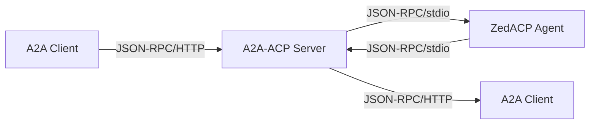

# A2A-ACP: Native A2A Protocol Server

**A2A-ACP** is a **native A2A protocol server** that exposes ZedACP agents via the modern **Agent-to-Agent (A2A) protocol** with JSON-RPC 2.0 over HTTP.

A complete implementation of the A2A v0.3.0 specification that bridges ZedACP agents to modern A2A clients.

### Key Features
- **A2A Protocol Compliance**: Full implementation of A2A v0.3.0 specification
- **ZedACP Integration**: Seamless bridge to existing ZedACP agents
- **Task Management**: Native A2A task and context lifecycle
- **Agent Cards**: Dynamic generation of A2A AgentCard manifests
- **Streaming Support**: Real-time message streaming with Server-Sent Events
- **Type Safety**: Complete Pydantic models with validation

```bash
# A2A JSON-RPC request
curl -X POST http://localhost:8001/ \
  -H "Content-Type: application/json" \
  -d '{
    "jsonrpc": "2.0",
    "method": "message/send",
    "id": "req_001",
    "params": {
      "message": {
        "role": "user",
        "parts": [{"kind": "text", "text": "Hello A2A!"}],
        "messageId": "msg_123"
      },
      "metadata": {"agent_name": "codex-acp"}
    }
  }'
```


A2A-ACP supports **persistent contexts with conversational memory** across multiple tasks, providing a full-featured **stateful agent platform**:

- 🎯 **Session Persistence**: Maintain conversation context across multiple runs
- 💾 **Message History**: Store and retrieve conversation history via API
- 🔄 **ZedACP Integration**: Leverage native ZedACP session persistence capabilities
- 🏗️ **Session Management**: Complete lifecycle management with cleanup and monitoring

```bash
# Create a stateful session
curl -X POST http://localhost:8001/runs \
  -H "Authorization: Bearer your-token" \
  -H "Content-Type: application/json" \
  -d '{
    "agent": "codex-acp",
    "session_id": "my-conversation-123",
    "input": {
      "role": "user",
      "content": [{"type": "text", "text": "Remember: My name is Alice"}]
    }
  }'

# Continue the conversation (agent remembers context)
curl -X POST http://localhost:8001/runs \
  -H "Authorization: Bearer your-token" \
  -H "Content-Type: application/json" \
  -d '{
    "agent": "codex-acp",
    "session_id": "my-conversation-123",
    "input": {
      "role": "user",
      "content": [{"type": "text", "text": "What is my name?"}]
    }
  }'

# Agent responds: "Your name is Alice" (context preserved!)
```

## The Agent Protocol Landscape

A2A-ACP bridges the gap between traditional ZedACP agents and modern A2A clients:

### ZedACP (Agent Client Protocol)
- **Creator**: Zed Industries (zed.dev)
- **Transport**: JSON-RPC over stdio (stdin/stdout)
- **Use Case**: Designed for IDE/editor integration
- **Agents**: `codex-acp`, `claude-code-acp`, `gemini-cli`, etc.
- **Protocol**: JSON-RPC with methods like `initialize`, `session/new`, `session/prompt`
- **Features**: Real-time streaming, tool calls, file system access, terminal integration

### A2A (Agent-to-Agent Protocol)
- **Transport**: JSON-RPC 2.0 over HTTP
- **Use Case**: Modern agent-to-agent communication
- **Clients**: A2A-compliant applications and platforms
- **Protocol**: Task-based operations with contexts and artifacts
- **Features**: Agent Cards, task management, structured content parts

## A2A-ACP: The Bridge Solution

A2A-ACP eliminates complexity by providing a **native A2A server** that:

1. **Accepts A2A JSON-RPC requests** (`message/send`, `tasks/get`, etc.)
2. **Translates them to ZedACP JSON-RPC** (`session/prompt`, `initialize`, etc.)
3. **Launches and manages ZedACP agents** as subprocesses
4. **Translates responses back to A2A format**
5. **Maintains protocol compliance** for both sides



## Architecture

A2A-ACP follows a clean **protocol bridge** architecture:

```
┌─────────────────┐    ┌──────────────────┐    ┌─────────────────┐
│   A2A Client    │    │  A2A-ACP Server  │    │   ZedACP Agent  │
│                 │◄──►│   (This Project) │◄──►│   (codex-acp)   │
│ • JSON-RPC/HTTP │    │                  │    │                 │
│ • Tasks         │    │ • Protocol Bridge│    │ • JSON-RPC/stdio│
│ • Agent Cards   │    │ • Task Manager   │    │ • Sessions      │
│ • Streaming     │    │ • Agent Manager  │    │ • initialize    │
└─────────────────┘    └──────────────────┘    └─────────────────┘
```

## Key Features

### 🏗️ **Native A2A Protocol Server**
Complete implementation of A2A v0.3.0 specification:

- **Task Management**: Native A2A task and context lifecycle management
- **Agent Cards**: Dynamic generation of comprehensive agent manifests
- **Message Parts**: Support for text, file, and data content parts
- **Protocol Compliance**: Full A2A v0.3.0 JSON-RPC 2.0 implementation

### 🔄 **Protocol Translation**
Seamless bridging between A2A and ZedACP protocols:

- A2A `message/send` ↔ ZedACP `session/prompt`
- A2A `message/stream` ↔ ZedACP streaming responses
- A2A `tasks/*` ↔ ZedACP session management
- A2A contexts ↔ ZedACP sessions with proper mapping

### 🚀 **Agent Management**
Robust subprocess management for ZedACP agents:

- Launch ZedACP agents as subprocesses with proper lifecycle management
- Environment variable injection (API keys, authentication tokens)
- Graceful process lifecycle management with cleanup
- Concurrent context support with SQLite-backed persistence

### 📡 **Real-time Streaming**
Full support for A2A streaming capabilities:

- **Message Streaming**: Server-Sent Events for real-time message updates
- **Task Updates**: Live task status and progress notifications
- **Agent Responses**: Streaming agent message chunks
- **Cancellation**: Real-time task cancellation notifications

### 🔐 **Security & Authentication**
Comprehensive security for A2A communications:

- **API Key Authentication**: Support for API key security schemes
- **Bearer Token Support**: JWT and bearer token authentication
- **Agent Security**: Secure credential injection for ZedACP agents
- **Request Validation**: Comprehensive request validation and sanitization

### 🎯 **ZedACP Agent Compatibility**
Works with any ZedACP-compliant agent:

- ✅ `codex-acp` (OpenAI)
- ✅ `claude-code-acp` (Anthropic)
- ✅ `gemini-cli` (Google)
- ✅ Any ZedACP-compliant agent with session persistence

### 💾 **Data Persistence**
Robust storage layer for A2A state:

- **SQLite Database**: Context and message storage with WAL mode
- **Message History**: Complete conversation archiving
- **Context Metadata**: Activity tracking and lifecycle management
- **Cross-restart Persistence**: Contexts survive server restarts

## Quick Start

### Prerequisites
- Python 3.9+
- `uv` package manager
- ZedACP agent (e.g., `codex-acp`)

### Installation

```bash
# Clone the repository
git clone https://github.com/mrorigo/acp-squared.git
cd a2a-acp

# Install dependencies
make dev-install

# Configure your ZedACP agent
cp config/agents.json.example config/agents.json
# Edit config/agents.json with your agent details
```

### Configuration

```json
{
  "agents": [
    {
      "name": "codex-acp",
      "description": "OpenAI Codex agent",
      "command": ["/path/to/codex-acp"],
      "api_key": "${OPENAI_API_KEY}"
    }
  ]
}
```

### Session Management

A2A-ACP supports stateful contexts that maintain conversation context across multiple tasks:

```bash
# Create a stateful session
curl -X POST http://localhost:8001/runs \
  -H "Authorization: Bearer your-token" \
  -H "Content-Type: application/json" \
  -d '{
    "agent": "codex-acp",
    "session_id": "my-session-123",
    "mode": "sync",
    "input": {
      "role": "user",
      "content": [{"type": "text", "text": "Remember: My favorite color is blue"}]
    }
  }'

# Continue the conversation (context preserved)
curl -X POST http://localhost:8001/runs \
  -H "Authorization: Bearer your-token" \
  -H "Content-Type: application/json" \
  -d '{
    "agent": "codex-acp",
    "session_id": "my-session-123",
    "mode": "sync",
    "input": {
      "role": "user",
      "content": [{"type": "text", "text": "What is my favorite color?"}]
    }
  }'

# List all sessions
curl -H "Authorization: Bearer your-token" \
     http://localhost:8001/sessions

# Get session details and history
curl -H "Authorization: Bearer your-token" \
     http://localhost:8001/sessions/my-session-123

# Delete session when done
curl -X DELETE \
  -H "Authorization: Bearer your-token" \
  http://localhost:8001/sessions/my-session-123
```

### Run the Server

```bash
# Set authentication token
export A2A_AUTH_TOKEN="your-secret-token"

# Start the proxy server
make run

# Server will be available at http://localhost:8001
```

### Test the Integration

```bash
# Ping the server
curl -H "Authorization: Bearer your-secret-token" \
     http://localhost:8001/ping

# List available agents
curl -H "Authorization: Bearer your-secret-token" \
     http://localhost:8001/agents

# Create a run
curl -X POST http://localhost:8001/runs \
  -H "Authorization: Bearer your-secret-token" \
  -H "Content-Type: application/json" \
  -d '{
    "agent": "codex-acp",
    "mode": "sync",
    "input": {
      "role": "user",
      "content": [{"type": "text", "text": "Hello, world!"}]
    }
  }'

# Create a stateful run with session persistence
curl -X POST http://localhost:8001/runs \
  -H "Authorization: Bearer your-secret-token" \
  -H "Content-Type: application/json" \
  -d '{
    "agent": "codex-acp",
    "session_id": "my-conversation-123",
    "mode": "sync",
    "input": {
      "role": "user",
      "content": [{"type": "text", "text": "Remember: My name is Alice"}]
    }
  }'

# List all sessions
curl -H "Authorization: Bearer your-secret-token" \
     http://localhost:8001/sessions

# Get session details and message history
curl -H "Authorization: Bearer your-secret-token" \
     http://localhost:8001/sessions/my-conversation-123

# Delete a session
curl -X DELETE \
  -H "Authorization: Bearer your-secret-token" \
  http://localhost:8001/sessions/my-conversation-123
```

## API Reference

A2A-ACP implements the full **A2A v0.3.0 specification**:

### Core Endpoints

| Method | Endpoint | Description |
|--------|----------|-------------|
| `GET` | `/ping` | Health check |
| `GET` | `/agents` | List available agents |
| `GET` | `/agents/{name}` | Get agent manifest |
| `POST` | `/runs` | Create new run (sync/stream) |
| `POST` | `/runs/{id}/cancel` | Cancel running run |

### Session Management Endpoints

| Method | Endpoint | Description |
|--------|----------|-------------|
| `GET` | `/sessions` | List ACP sessions with optional filtering |
| `GET` | `/sessions/{id}` | Get detailed session info and message history |
| `DELETE` | `/sessions/{id}` | Delete session and all associated data |

### Run Modes

- **`sync`**: Traditional request/response
- **`stream`**: Server-Sent Events for real-time updates
- **`async`**: Fire-and-forget with webhooks (future)

### Session Support

Runs can be associated with sessions for stateful conversations:

```json
{
  "agent": "codex-acp",
  "session_id": "my-conversation-123",
  "mode": "sync",
  "input": {
    "role": "user",
    "content": [{"type": "text", "text": "Hello!"}]
  }
}
```

- **`session_id`**: Optional field for stateful sessions
- **Session Persistence**: Conversations maintain context across multiple runs
- **Message History**: Automatic storage and retrieval via session management APIs

### Message Format

A2A-ACP translates between ZedACP content blocks and A2A message parts:

```typescript
// IBM ACP Input
{
  "role": "user",
  "content": [
    {"type": "text", "text": "Hello"},
    {"type": "image", "data": "...", "mimeType": "image/png"}
  ]
}

// ZedACP Translation
{
  "sessionId": "sess_123",
  "prompt": [
    {"type": "text", "text": "Hello"},
    {"type": "image", "data": "...", "mimeType": "image/png"}
  ]
}
```

## A2A Protocol Implementation

A2A-ACP provides a **native A2A v0.3.0 server** that bridges ZedACP agents to the modern A2A protocol:

### A2A Core Concepts

**Key A2A Types:**
- **AgentCard**: Self-describing agent manifest with capabilities and skills
- **Task**: Stateful operation with context ID, status, history, and artifacts
- **Message**: Communication unit with parts (text, files, data)
- **Context**: Groups related tasks and maintains conversation state
- **Artifact**: Generated files or data structures from task execution

### A2A Methods Implemented

| Method | Description | Implementation |
|--------|-------------|----------------|
| `message/send` | Send a message and create a task | ✅ Full ZedACP integration |
| `message/stream` | Streaming message exchange | ✅ Server-Sent Events |
| `tasks/get` | Retrieve task information | ✅ With history support |
| `tasks/list` | List tasks with filtering | ✅ Pagination support |
| `tasks/cancel` | Cancel running tasks | ✅ ZedACP cancellation |
| `agent/getAuthenticatedExtendedCard` | Get agent capabilities | ✅ Dynamic generation |

### A2A Quick Start

```bash
# 1. Start the A2A server
export A2A_AUTH_TOKEN="your-token"
make run

# 2. Send an A2A message
curl -X POST http://localhost:8001/ \
  -H "Content-Type: application/json" \
  -d '{
    "jsonrpc": "2.0",
    "method": "message/send",
    "id": "test_001",
    "params": {
      "message": {
        "role": "user",
        "parts": [{"kind": "text", "text": "Hello A2A!"}],
        "messageId": "msg_123"
      },
      "metadata": {"agent_name": "codex-acp"}
    }
  }'

# 3. Get agent capabilities
curl -X POST http://localhost:8001/ \
  -H "Content-Type: application/json" \
  -d '{
    "jsonrpc": "2.0",
    "method": "agent/getAuthenticatedExtendedCard",
    "id": "card_001",
    "params": {}
  }'
```

### A2A Architecture

```
┌─────────────┐    ┌─────────────┐    ┌─────────────┐
│   A2A       │    │  A2A-ACP    │    │   ZedACP    │
│   Client    │◄──►│   Server    │◄──►│   Agent     │
│             │    │             │    │             │
│ • JSON-RPC  │    │ • Protocol  │    │ • JSON-RPC  │
│ • HTTP      │    │ • Bridge    │    │ • stdio     │
│ • Tasks     │    │ • Tasks     │    │ • Sessions  │
└─────────────┘    └─────────────┘    └─────────────┘
```

### A2A-ACP vs Legacy ACP

| Feature | Legacy ACP Bridge | A2A-ACP (Current) |
|---------|-------------------|-------------------|
| **Protocol** | IBM ACP (REST) | A2A v0.3.0 (JSON-RPC) |
| **Transport** | HTTP/REST | HTTP/JSON-RPC 2.0 |
| **Task Model** | Runs | Tasks & Contexts |
| **Agent Cards** | Static manifests | Dynamic generation |
| **Streaming** | Server-Sent Events | JSON-RPC streaming |
| **Use Case** | Legacy compatibility | Modern A2A clients |

## ZedACP Protocol Compliance

A2A-ACP implements the complete A2A task lifecycle:

### 1. **Initialization**
```json
// Client → Agent
{
  "jsonrpc": "2.0",
  "id": 0,
  "method": "initialize",
  "params": {
    "protocolVersion": 1,
    "clientCapabilities": {
      "fs": {"readTextFile": true, "writeTextFile": true},
      "terminal": true
    }
  }
}
```

### 2. **Authentication** (if required)
```json
{
  "jsonrpc": "2.0",
  "id": 1,
  "method": "authenticate",
  "params": {"methodId": "apikey"}
}
```

### 3. **Session Management**
```json
{
  "jsonrpc": "2.0",
  "id": 2,
  "method": "session/new",
  "params": {
    "cwd": "/project",
    "mcpServers": [...]
  }
}
```

### 4. **Prompt Processing**
```json
{
  "jsonrpc": "2.0",
  "id": 3,
  "method": "session/prompt",
  "params": {
    "sessionId": "sess_123",
    "prompt": [...]
  }
}
```

### 5. **Real-time Updates**
```json
{
  "jsonrpc": "2.0",
  "method": "session/update",
  "params": {
    "sessionId": "sess_123",
    "update": {
      "sessionUpdate": "agent_message_chunk",
      "content": {"type": "text", "text": "Thinking..."}
    }
  }
}
```

## Deployment

### Docker (Recommended)

```dockerfile
FROM python:3.11-slim

WORKDIR /app
COPY . /app

RUN pip install uv
RUN make dev-install

EXPOSE 8001
ENV A2A_AUTH_TOKEN="your-secret-token"

CMD ["uvicorn", "src.a2a_acp.main:create_app", "--host", "0.0.0.0", "--port", "8001"]
```

### Production Considerations

- **Reverse Proxy**: Use nginx/traefik for TLS termination
- **Authentication**: Rotate tokens regularly
- **Monitoring**: Add structured logging and metrics
- **Scaling**: Deploy multiple instances behind load balancer
- **Security**: Run in isolated environment with minimal privileges

## Development

### Project Structure

```
a2a-acp/
├── src/
│   └── a2a_acp/           # A2A-ACP Main Application
│       ├── __init__.py     # Package initialization
│       ├── main.py         # FastAPI application (A2A JSON-RPC server)
│       ├── database.py     # A2A context and message persistence
│       ├── agent_registry.py # ZedACP agent configuration
│       ├── zed_agent.py    # ZedACP subprocess management
│       ├── settings.py     # Application settings
│       └── logging_config.py # Structured logging setup
├── src/a2a/               # A2A Protocol Implementation
│   ├── __init__.py         # A2A package initialization
│   ├── server.py           # A2A JSON-RPC 2.0 HTTP server
│   ├── models.py           # Complete A2A type definitions
│   ├── translator.py       # A2A ↔ ZedACP translation layer
│   ├── agent_manager.py    # ZedACP agent connection management
│   └── agent_card.py       # Dynamic Agent Card generation
├── tests/                  # Comprehensive test suite
│   ├── test_a2a_server.py  # A2A protocol tests (20 tests)
│   └── dummy_agent.py      # Test ZedACP agent
├── config/                 # Configuration
│   └── agents.json         # ZedACP agent definitions
└── docs/                   # Documentation
    ├── A2A_PLAN.md         # Complete A2A implementation plan
    ├── research.md         # Protocol research
    ├── ZedACP.md           # ZedACP specification
    └── a2a/                # A2A protocol specification
```

### Running Tests

```bash
# Run all tests (A2A-ACP + A2A)
make test

# Run with coverage
make test-coverage

# Run legacy ACP tests only
python -m pytest tests/test_runs.py tests/test_agents.py tests/test_stateful_agents.py -v

# Run A2A tests only
python -m pytest tests/test_a2a_server.py -v

# Run specific test
python -m pytest tests/test_a2a_server.py::TestA2AServer::test_server_creation -v
```

### Adding New ZedACP Agents

1. **Install the agent** (e.g., `codex-acp`, `claude-code-acp`)
2. **Add to config/agents.json**:
   ```json
   {
     "name": "new-agent",
     "description": "Description of the agent",
     "command": ["/path/to/agent", "--stdio"],
     "api_key": "${API_KEY_ENV_VAR}"
   }
   ```
3. **Set environment variables** for API keys
4. **Restart the server** and test

## Choosing Between Legacy ACP and A2A-ACP

### Use Legacy ACP Bridge when:
- **Legacy Compatibility**: Working with existing IBM ACP clients
- **RESTful APIs**: Need traditional HTTP REST endpoints (`/runs`, `/agents`)
- **Drop-in Replacement**: Minimal changes to existing IBM ACP integrations
- **Mixed Environments**: Supporting both modern and legacy clients

### Use A2A-ACP (Native A2A) when:
- **Modern Clients**: Working with A2A-compliant applications
- **Task-based Workflows**: Need native A2A task and context management
- **Agent Discovery**: Require dynamic Agent Card generation
- **Future-proof**: Building new integrations with latest protocol standards

### Use Both when:
- **Migration Path**: Transitioning from IBM ACP to A2A gradually
- **Dual Support**: Supporting both legacy and modern clients
- **Maximum Compatibility**: Broadest possible client compatibility

## Why A2A-ACP?

### For ZedACP Agent Developers
- **Instant HTTP API**: No need to implement HTTP servers
- **Cloud Compatibility**: Deploy agents in cloud environments
- **Multi-client Support**: Serve multiple HTTP clients simultaneously
- **Standard Interface**: Consistent API across all agents

### For IBM ACP Client Developers
- **Agent Ecosystem**: Access to all ZedACP agents
- **Transparent Proxy**: No protocol knowledge required
- **Drop-in Replacement**: Works with existing IBM ACP clients
- **Performance**: Efficient subprocess management

### For Platform Builders
- **Agent Marketplace**: Host multiple agents behind single endpoint
- **Unified Interface**: Consistent API for diverse agents
- **Easy Integration**: Simple configuration-based setup
- **Production Ready**: Robust error handling and logging

## Why A2A-ACP?

### For Modern Agent Ecosystems
- **Protocol Future**: Built on the latest A2A v0.3.0 specification
- **Rich Metadata**: Comprehensive Agent Cards with skills and capabilities
- **Type Safety**: Complete Pydantic models with validation
- **Task Management**: Native A2A task lifecycle with contexts and artifacts

### For A2A Client Developers
- **Native Support**: Direct A2A protocol implementation
- **Agent Discovery**: Rich capability advertisement via Agent Cards
- **Streaming**: Real-time message streaming with proper event sequencing
- **Standards Compliant**: Full A2A specification compliance

### For Platform Builders
- **Modern Architecture**: Built for contemporary agent platforms
- **Scalable Design**: Efficient task and context management
- **Enterprise Ready**: Comprehensive security and authentication schemes
- **Interoperable**: Works with any A2A-compliant client

## Troubleshooting

### Common Issues

**"Agent not found"**
- Check `config/agents.json` configuration
- Verify agent binary path and permissions
- Ensure agent is installed and accessible

**"Authentication failed"**
- Verify `A2A_AUTH_TOKEN` environment variable
- Check agent API key configuration
- Review ZedACP agent authentication requirements

**"Protocol parsing errors"**
- Check ZedACP agent output format
- Verify JSON-RPC message structure
- Review subprocess stdout/stderr logs

**"Streaming not working"**
- Ensure client supports Server-Sent Events
- Check for proxy/firewall interference
- Verify ZedACP agent supports streaming

### Debug Mode

Enable verbose logging:

```bash
export A2A_LOG_LEVEL=DEBUG
export A2A_AUTH_TOKEN="your-token"
python -m uvicorn src.a2a_acp.main:create_app --reload
```

## Contributing

We welcome contributions! Please see [CONTRIBUTING.md](CONTRIBUTING.md) for guidelines.

### Development Philosophy
- **KISS (Keep It Simple)**: Avoid over-engineering
- **Protocol Compliance**: Maintain strict ZedACP and IBM ACP compatibility
- **Comprehensive Testing**: Test all protocol edge cases
- **Production Ready**: Robust error handling and logging

## License

This project is licensed under the Apache License 2.0 - see the [LICENSE](LICENSE) file for details.

## Acknowledgments

- **Zed Industries** for the Agent Client Protocol specification
- **IBM** for the Agent Communication Protocol specification
- **ACP Community** for advancing agent interoperability

## Project Status

### ✅ A2A-ACP Implementation Complete
- **Full A2A v0.3.0 Protocol**: Complete implementation with all core methods
- **ZedACP Integration**: Seamless bridge to existing ZedACP agents
- **Comprehensive Testing**: 20/20 A2A tests covering all functionality
- **Production Ready**: Robust error handling and type safety
- **Type Safety**: Complete Pydantic models with validation
- **Documentation**: Comprehensive API documentation and examples

### 🎯 **A2A-ACP Features**
- **Task Management**: Native A2A task and context lifecycle
- **Agent Cards**: Dynamic generation of agent capability manifests
- **Streaming Support**: Real-time message streaming with Server-Sent Events
- **Protocol Translation**: Seamless A2A ↔ ZedACP message conversion
- **Agent Discovery**: Rich capability advertisement via Agent Cards

### 🚀 **Ready for Production**
A2A-ACP is a **complete, production-ready A2A protocol server** that provides:

- **Modern A2A Protocol**: Built on A2A v0.3.0 specification
- **ZedACP Compatibility**: Works with all existing ZedACP agents
- **Enterprise Ready**: Comprehensive security and authentication
- **Scalable Architecture**: Efficient task and context management
- **Future-proof**: Designed for modern agent ecosystems

See [`docs/A2A_PLAN.md`](docs/A2A_PLAN.md) for the complete implementation plan.

---

**A2A-ACP** - The native A2A protocol server for ZedACP agents! 🤖✨