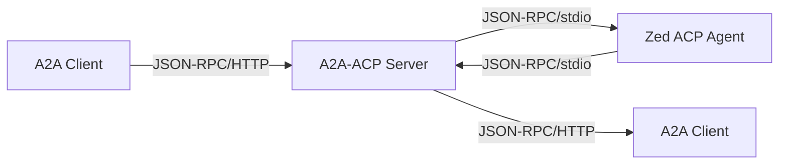

# A2A-ACP: Native A2A Protocol Server

**A2A-ACP** is a **native A2A protocol server** that exposes Zed ACP agents via the modern **Agent-to-Agent (A2A) protocol** with JSON-RPC 2.0 over HTTP.

A complete implementation of the A2A v0.3.0 specification that bridges Zed ACP agents to modern A2A clients.

## 🚀 Quick Start

Get started in minutes with our streamlined setup:

```bash
# 1. Install and configure
git clone https://github.com/mrorigo/acp-squared.git
cd a2a-acp
uv sync && uv pip install -e .

# 2. Configure your Zed ACP agent
export A2A_AGENT_COMMAND="/usr/local/bin/codex-acp"
export A2A_AGENT_API_KEY="${OPENAI_API_KEY}"
export A2A_AUTH_TOKEN="your-secret-token"

# (Optional) Try the bundled dummy agent for local development
# export A2A_AGENT_COMMAND="python tests/dummy_agent.py"

# 3. Start the server
make run

# 4. Send your first message
curl -X POST http://localhost:8001/ \
  -H "Content-Type: application/json" \
  -d '{
    "jsonrpc": "2.0",
    "method": "message/send",
    "id": "req_001",
    "params": {
      "message": {
        "role": "user",
        "parts": [{"kind": "text", "text": "Hello A2A!"}],
        "messageId": "msg_123"
      },
      "metadata": {"agent_name": "codex-acp"}
    }
  }'
```

**🎉 That's it!** You're now running A2A-ACP with a Zed ACP agent.

## 📚 Documentation

For comprehensive documentation, see our [user-docs/](user-docs/) folder:

### 🚀 **Getting Started**
- **[Quick Start Tutorial](user-docs/quick-start.md)** - Get running in 5 minutes
- **[Installation Guide](user-docs/installation.md)** - Complete installation instructions
- **[Configuration Guide](user-docs/configuration.md)** - Environment variables and settings

### 📖 **Core Documentation**
- **[API Methods Reference](user-docs/api-methods.md)** - Complete JSON-RPC API reference
- **[Architecture Overview](user-docs/architecture.md)** - System design and components
- **[A2A Protocol Guide](user-docs/a2a-protocol.md)** - A2A v0.3.0 implementation details
- **[Zed ACP Integration](user-docs/zed-acp-integration.md)** - Zed ACP agent bridging

### 🛠️ **Advanced Features**
- **[Tool Execution System](user-docs/tool-execution.md)** - Bash-based tool execution capabilities
- **[Interactive Conversations](user-docs/interactive-conversations.md)** - Input-required workflows
- **[Push Notifications](user-docs/push-notifications.md)** - HTTP webhooks and real-time events
- **[Streaming Support](user-docs/streaming.md)** - Server-Sent Events and real-time updates

### 🚢 **Deployment & Operations**
- **[Deployment Guide](user-docs/deployment.md)** - Production deployment instructions
- **[Docker Deployment](user-docs/docker-deployment.md)** - Containerized deployment
- **[Monitoring & Observability](user-docs/monitoring.md)** - Health checks and metrics
- **[Troubleshooting](user-docs/troubleshooting.md)** - Common issues and solutions

### 💻 **Development**
- **[Development Setup](user-docs/development-setup.md)** - Local development environment
- **[Testing Guide](user-docs/testing.md)** - Running and writing tests (240+ tests)
- **[Contributing Guide](user-docs/contributing.md)** - How to contribute to the project
- **Streaming Health Check**
  ```bash
  # Validate JSON-RPC + HTTP streaming against the spec
  PYTHONPATH=. uv run pytest tests/test_a2a_acp_bridge.py::TestStreamingCompliance

  # Exercise the real dummy agent and confirm streamed markers arrive at the client
  PYTHONPATH=. uv run pytest tests/test_a2a_acp_bridge.py::TestDummyAgentIntegration::test_dummy_agent_streams_marker
  ```

## ✨ Key Features

- **🔗 A2A Protocol Compliance**: Full A2A v0.3.0 specification implementation
- **🤖 Zed ACP Integration**: Seamless bridge to existing Zed ACP agents (`codex-acp`, `claude-code-acp`, etc.)
- **📋 Task Management**: Native A2A task and context lifecycle management
- **💬 Interactive Conversations**: Input-required workflows for multi-turn agent interactions
- **📡 Push Notifications**: HTTP webhooks with filtering, analytics, and retry logic
- **🎯 Agent Cards**: Dynamic generation of comprehensive agent capability manifests
- **🔍 Agent Discovery**: Well-known HTTP endpoint for agent capability advertisement
- **⚡ Streaming Support**: Real-time message streaming with Server-Sent Events
- **🛠️ Tool Execution**: Bash-based tool execution with unlimited flexibility
- **🔒 Enterprise Security**: Comprehensive security with authentication and audit logging
- **📊 Production Ready**: Robust error handling, monitoring, and comprehensive testing

## 🎯 What Makes A2A-ACP Special?

### **Modern Protocol Bridge**
A2A-ACP eliminates complexity by providing a **native A2A server** that:
- Accepts A2A JSON-RPC requests (`message/send`, `tasks/get`, etc.)
- Translates them to Zed ACP JSON-RPC (`session/prompt`, `initialize`, etc.)
- Launches and manages Zed ACP agents as subprocesses
- Translates responses back to A2A format
- Maintains protocol compliance for both sides

### **Production-Ready Architecture**
- **✅ 240+ comprehensive tests** covering all functionality
- **✅ Full A2A v0.3.0 compliance** with input-required workflows
- **✅ Enterprise-grade security** with audit logging and resource quotas
- **✅ Bash-based tool execution** with unlimited flexibility
- **✅ Real-time push notifications** with delivery analytics
- **✅ Stateful conversations** with context persistence across tasks

### **Developer Experience**
- **🚀 5-minute setup** with environment variable configuration
- **📚 Comprehensive documentation** with practical examples
- **🧪 Extensive test coverage** ensuring reliability
- **🔧 Simple deployment** with Docker and orchestration support
- **📈 Production monitoring** with health checks and metrics

## 🤝 Supported Agents

Works with any Zed ACP-compliant agent:
- ✅ **`codex-acp`** (OpenAI)
- ✅ **`claude-code-acp`** (Anthropic)
- ✅ **`gemini-cli`** (Google)
- ✅ **Any Zed ACP-compliant agent** with session persistence

## 📈 Project Status

### ✅ **Implementation Complete**
- **A2A Protocol**: Full v0.3.0 implementation with all core methods
- **Zed ACP Integration**: Seamless bridge to existing Zed ACP agents
- **Interactive Conversations**: Complete input-required workflow support
- **Push Notifications**: HTTP webhook system with filtering and analytics
- **Tool Execution**: Bash-based tool system with unlimited flexibility
- **Comprehensive Testing**: 240+ tests covering all functionality
- **Production Ready**: Robust error handling and enterprise security

### 🎯 **Key Achievements**
- **Protocol Compliance**: Native A2A v0.3.0 server with Zed ACP bridging
- **Tool System**: Bash-based tool execution with unlimited flexibility
- **Interactive Workflows**: Multi-turn conversations with pause/resume capability
- **Real-time Events**: Push notifications with delivery analytics
- **Enterprise Security**: Comprehensive audit logging and resource controls
- **Developer Experience**: Simple setup with extensive documentation

---

**Ready to explore?** 📖 Start with the [Quick Start Tutorial](user-docs/quick-start.md) or dive into the [API Methods Reference](user-docs/api-methods.md).

For the complete picture, browse our comprehensive [documentation index](user-docs/index.md).

---

**A2A-ACP** - The native A2A protocol server for modern agent ecosystems! 🤖✨

- 🎯 **Context Persistence**: Maintain conversation context across multiple tasks
- 💾 **Message History**: Store and retrieve conversation history via A2A API
- 🔄 **Zed ACP Integration**: Leverage native Zed ACP session persistence capabilities
- 🏗️ **Context Management**: Complete lifecycle management with cleanup and monitoring
- 💬 **Interactive Conversations**: Support for input-required workflows where agents can pause and request user clarification

```bash
# Send initial message (creates new context)
curl -X POST http://localhost:8001/ \
  -H "Content-Type: application/json" \
  -d '{
    "jsonrpc": "2.0",
    "method": "message/send",
    "id": "msg_001",
    "params": {
      "message": {
        "role": "user",
        "parts": [{"kind": "text", "text": "Remember: My name is Alice"}],
        "messageId": "msg_001"
      },
      "metadata": {"agent_name": "codex-acp"}
    }
  }'

# Response includes contextId for continuation:
# {
#   "jsonrpc": "2.0",
#   "id": "msg_001",
#   "result": {
#     "id": "task_123",
#     "contextId": "ctx_001",
#     "status": {"state": "completed"},
#     "history": [...]
#   }
# }

# Continue the conversation (context preserved)
curl -X POST http://localhost:8001/ \
  -H "Content-Type: application/json" \
  -d '{
    "jsonrpc": "2.0",
    "method": "message/send",
    "id": "msg_002",
    "params": {
      "message": {
        "role": "user",
        "parts": [{"kind": "text", "text": "What is my name?"}],
        "messageId": "msg_002",
        "contextId": "ctx_001"
      },
      "metadata": {"agent_name": "codex-acp"}
    }
  }'

# Agent responds: "Your name is Alice" (context preserved!)
```

## The Agent Protocol Landscape

A2A-ACP bridges the gap between Zed ACP agents and A2A clients:

### Zed ACP (Agent Client Protocol)
- **Creator**: Zed Industries (zed.dev)
- **Transport**: JSON-RPC over stdio (stdin/stdout)
- **Use Case**: Designed for IDE/editor integration
- **Agents**: `codex-acp`, `claude-code-acp`, `gemini-cli`, etc.
- **Protocol**: JSON-RPC with methods like `initialize`, `session/new`, `session/prompt`
- **Features**: Real-time streaming, tool calls, file system access, terminal integration

### A2A (Agent-to-Agent Protocol)
- **Transport**: JSON-RPC 2.0 over HTTP
- **Use Case**: Modern agent-to-agent communication
- **Clients**: A2A-compliant applications and platforms
- **Protocol**: Task-based operations with contexts and artifacts
- **Features**: Agent Cards, task management, structured content parts

## A2A-ACP: The Bridge Solution

A2A-ACP eliminates complexity by providing a **native A2A server** that:

1. **Accepts A2A JSON-RPC requests** (`message/send`, `tasks/get`, etc.)
2. **Translates them to Zed ACP JSON-RPC** (`session/prompt`, `initialize`, etc.)
3. **Launches and manages Zed ACP agents** as subprocesses
4. **Translates responses back to A2A format**
5. **Maintains protocol compliance** for both sides



## Architecture

A2A-ACP follows a clean **protocol bridge** architecture:

```
┌─────────────────┐    ┌──────────────────┐    ┌─────────────────┐
│   A2A Client    │    │  A2A-ACP Server  │    │   Zed ACP Agent  │
│                 │◄──►│   (This Project) │◄──►│   (codex-acp)   │
│ • JSON-RPC/HTTP │    │                  │    │                 │
│ • Tasks         │    │ • Protocol Bridge│    │ • JSON-RPC/stdio│
│ • Agent Cards   │    │ • Task Manager   │    │ • Sessions      │
│ • Streaming     │    │ • Agent Manager  │    │ • initialize    │
└─────────────────┘    └──────────────────┘    └─────────────────┘
```

## Key Features

### 🏗️ **Native A2A Protocol Server**
Complete implementation of A2A v0.3.0 specification:

- **Task Management**: Native A2A task and context lifecycle management
- **Agent Cards**: Dynamic generation of comprehensive agent manifests
- **Message Parts**: Support for text, file, and data content parts
- **Protocol Compliance**: Full A2A v0.3.0 JSON-RPC 2.0 implementation

### 🔄 **Protocol Translation**
Seamless bridging between A2A and Zed ACP protocols:

- A2A `message/send` ↔ Zed ACP `session/prompt`
- A2A `message/stream` ↔ Zed ACP streaming responses
- A2A `tasks/*` ↔ Zed ACP session management
- A2A contexts ↔ Zed ACP sessions with proper mapping

### 🚀 **Agent Management**
Robust subprocess management for Zed ACP agents:

- Launch Zed ACP agents as subprocesses with proper lifecycle management
- Environment variable injection (API keys, authentication tokens)
- Graceful process lifecycle management with cleanup
- Concurrent context support with SQLite-backed persistence

### 📡 **Real-time Streaming**
Full support for A2A streaming capabilities:

- **Message Streaming**: Server-Sent Events for real-time message updates
- **Task Updates**: Live task status and progress notifications
- **Agent Responses**: Streaming agent message chunks
- **Cancellation**: Real-time task cancellation notifications

### 🔐 **Security & Authentication**
Comprehensive security for A2A communications:

- **API Key Authentication**: Support for API key security schemes
- **Bearer Token Support**: JWT and bearer token authentication
- **Agent Security**: Secure credential injection for Zed ACP agents
- **Request Validation**: Comprehensive request validation and sanitization

### 🎯 **Zed ACP Agent Compatibility**
Works with any Zed ACP-compliant agent:

- ✅ `codex-acp` (OpenAI)
- ✅ `claude-code-acp` (Anthropic)
- ✅ `gemini-cli` (Google)
- ✅ Any Zed ACP-compliant agent with session persistence

### 💾 **Data Persistence**
Robust storage layer for A2A state:

- **SQLite Database**: Context and message storage with WAL mode
- **Message History**: Complete conversation archiving
- **Context Metadata**: Activity tracking and lifecycle management
- **Cross-restart Persistence**: Contexts survive server restarts

## Quick Start

### Prerequisites
- Python 3.9+
- `uv` package manager
- Zed ACP agent (e.g., `codex-acp`)

### Installation

```bash
# Clone the repository
git clone https://github.com/mrorigo/acp-squared.git
cd a2a-acp

# Install dependencies
make dev-install

# Configure your Zed ACP agent (simplified)
cp .env.example .env
# Edit .env with your agent details (see configuration section below)
```

### Configuration

A2A-ACP uses **environment variables** for simplified configuration (recommended):

```bash
# Required: Agent command
export A2A_AGENT_COMMAND="/usr/local/bin/codex-acp"

# Optional: API key for agent authentication
export A2A_AGENT_API_KEY="${OPENAI_API_KEY}"

# Optional: Agent description
export A2A_AGENT_DESCRIPTION="OpenAI Codex for A2A-ACP"

# Optional: Authentication token for A2A-ACP server
export A2A_AUTH_TOKEN="your-secret-token"
```

**Alternative:** Legacy JSON configuration (deprecated but supported):

```json
{
  "_deprecated": "Use environment variables instead",
  "codex-acp": {
    "name": "codex-acp",
    "command": ["/usr/local/bin/codex-acp"],
    "api_key": "${OPENAI_API_KEY}",
    "description": "OpenAI Codex agent"
  }
}
```

### Context Management

A2A-ACP supports stateful contexts that maintain conversation context across multiple tasks:

```bash
# Send message to create new context
curl -X POST http://localhost:8001/ \
  -H "Content-Type: application/json" \
  -d '{
    "jsonrpc": "2.0",
    "method": "message/send",
    "id": "msg_001",
    "params": {
      "message": {
        "role": "user",
        "parts": [{"kind": "text", "text": "Remember: My favorite color is blue"}],
        "messageId": "msg_001"
      },
      "metadata": {"agent_name": "codex-acp"}
    }
  }'

# Continue the conversation (context preserved)
curl -X POST http://localhost:8001/ \
  -H "Content-Type: application/json" \
  -d '{
    "jsonrpc": "2.0",
    "method": "message/send",
    "id": "msg_002",
    "params": {
      "message": {
        "role": "user",
        "parts": [{"kind": "text", "text": "What is my favorite color?"}],
        "messageId": "msg_002",
        "contextId": "ctx_001"
      },
      "metadata": {"agent_name": "codex-acp"}
    }
  }'

# List all tasks
curl -X POST http://localhost:8001/ \
  -H "Content-Type: application/json" \
  -d '{
    "jsonrpc": "2.0",
    "method": "tasks/list",
    "id": "list_001",
    "params": {}
  }'

# Get task details and history
curl -X POST http://localhost:8001/ \
  -H "Content-Type: application/json" \
  -d '{
    "jsonrpc": "2.0",
    "method": "tasks/get",
    "id": "get_001",
    "params": {
      "id": "task_123",
      "historyLength": 10
    }
  }'
```

### Run the Server

```bash
# Set authentication token
export A2A_AUTH_TOKEN="your-secret-token"

# Start the proxy server
make run

# Server will be available at http://localhost:8001
```

### Test the Integration

```bash
# Ping the server (health check)
curl -X GET http://localhost:8000/health

# Get agent capabilities (JSON-RPC)
curl -X POST http://localhost:8001/ \
  -H "Content-Type: application/json" \
  -d '{
    "jsonrpc": "2.0",
    "method": "agent/getAuthenticatedExtendedCard",
    "id": "card_001",
    "params": {}
  }'

# Get agent capabilities (HTTP well-known endpoint)
curl -X GET http://localhost:8001/.well-known/agent-card.json

# Send a message
curl -X POST http://localhost:8001/ \
  -H "Content-Type: application/json" \
  -d '{
    "jsonrpc": "2.0",
    "method": "message/send",
    "id": "msg_001",
    "params": {
      "message": {
        "role": "user",
        "parts": [{"kind": "text", "text": "Hello, world!"}],
        "messageId": "msg_001"
      },
      "metadata": {"agent_name": "codex-acp"}
    }
  }'

# Send message with context (stateful conversation)
curl -X POST http://localhost:8001/ \
  -H "Content-Type: application/json" \
  -d '{
    "jsonrpc": "2.0",
    "method": "message/send",
    "id": "msg_002",
    "params": {
      "message": {
        "role": "user",
        "parts": [{"kind": "text", "text": "Remember: My name is Alice"}],
        "messageId": "msg_002"
      },
      "metadata": {"agent_name": "codex-acp"}
    }
  }'

# List all tasks
curl -X POST http://localhost:8001/ \
  -H "Content-Type: application/json" \
  -d '{
    "jsonrpc": "2.0",
    "method": "tasks/list",
    "id": "list_001",
    "params": {}
  }'

# Get task details and history
curl -X POST http://localhost:8001/ \
  -H "Content-Type: application/json" \
  -d '{
    "jsonrpc": "2.0",
    "method": "tasks/get",
    "id": "get_001",
    "params": {
      "id": "task_123",
      "historyLength": 10
    }
  }'

# Cancel a task
curl -X POST http://localhost:8001/ \
  -H "Content-Type: application/json" \
  -d '{
    "jsonrpc": "2.0",
    "method": "tasks/cancel",
    "id": "cancel_001",
    "params": {
      "id": "task_123"
    }
  }'
```

## Push Notifications

A2A-ACP includes comprehensive **push notification support** for real-time task monitoring and event-driven workflows. The system provides HTTP webhook notifications with sophisticated filtering, retry logic, and delivery analytics.

### Push Notification Features

- **🔗 HTTP Webhooks**: Configurable webhook endpoints for task events
- **🔐 Authentication Support**: Bearer tokens, API keys, and custom authentication schemes
- **📊 Event Filtering**: Sophisticated filtering by event type, quiet hours, and priority levels
- **📈 Delivery Analytics**: Real-time tracking of delivery success rates and performance metrics
- **🔄 Retry Logic**: Exponential backoff with configurable retry attempts
- **🧹 Automatic Cleanup**: Lifecycle-based cleanup of notification configurations
- **📡 Real-time Streaming**: WebSocket and Server-Sent Events integration

### Configuration

Configure push notifications using the A2A `tasks/pushNotificationConfig/*` methods:

```bash
# Set up a webhook endpoint
curl -X POST http://localhost:8001/ \
  -H "Content-Type: application/json" \
  -d '{
    "jsonrpc": "2.0",
    "method": "tasks/pushNotificationConfig/set",
    "id": "config_001",
    "params": {
      "taskId": "task_123",
      "config": {
        "id": "webhook_001",
        "url": "https://your-app.com/webhooks/a2a",
        "token": "your-bearer-token",
        "enabledEvents": ["status_change", "message", "artifact"],
        "quietHoursStart": "22:00",
        "quietHoursEnd": "08:00"
      }
    }
  }'

# List notification configurations
curl -X POST http://localhost:8001/ \
  -H "Content-Type: application/json" \
  -d '{
    "jsonrpc": "2.0",
    "method": "tasks/pushNotificationConfig/list",
    "id": "list_001",
    "params": {
      "taskId": "task_123"
    }
  }'
```

### Environment Variables

```bash
# Push notification configuration
export PUSH_NOTIFICATIONS_ENABLED=true
export PUSH_NOTIFICATION_WEBHOOK_TIMEOUT=30
export PUSH_NOTIFICATION_RETRY_ATTEMPTS=3
export PUSH_NOTIFICATION_BATCH_SIZE=10

# Security
export PUSH_NOTIFICATION_HMAC_SECRET="your-secret-key"
export PUSH_NOTIFICATION_RATE_LIMIT_PER_MINUTE=60

# Cleanup configuration
export PUSH_NOTIFICATION_CLEANUP_ENABLED=true
export PUSH_NOTIFICATION_CLEANUP_INTERVAL=3600
```

### API Reference

A2A-ACP implements the full **A2A v0.3.0 specification** plus push notification extensions:

### Core A2A JSON-RPC Methods

| Method | Description | Implementation |
|--------|-------------|----------------|
| `message/send` | Send a message and create a task | ✅ Full Zed ACP integration |
| `message/stream` | Streaming message exchange | ✅ Server-Sent Events |
| `tasks/get` | Retrieve task information | ✅ With history support |
| `tasks/list` | List tasks with filtering | ✅ Pagination support |
| `tasks/cancel` | Cancel running tasks | ✅ Zed ACP cancellation |
| `agent/getAuthenticatedExtendedCard` | Get agent capabilities | ✅ Dynamic generation |

### Push Notification Methods

| Method | Description | Implementation |
|--------|-------------|----------------|
| `tasks/pushNotificationConfig/set` | Configure webhook notifications | ✅ Full configuration support |
| `tasks/pushNotificationConfig/get` | Retrieve notification configuration | ✅ Complete config retrieval |
| `tasks/pushNotificationConfig/list` | List all notification configurations | ✅ Filtering and pagination |
| `tasks/pushNotificationConfig/delete` | Delete notification configuration | ✅ Cleanup and removal |

### Notification Events

A2A-ACP sends notifications for the following task events:

#### Task Status Changes
```json
{
  "event": "status_change",
  "task_id": "task_123",
  "timestamp": "2024-01-15T10:30:00Z",
  "data": {
    "old_state": "working",
    "new_state": "completed"
  },
  "old_state": "working",
  "new_state": "completed"
}
```

#### New Messages
```json
{
  "event": "message",
  "task_id": "task_123",
  "timestamp": "2024-01-15T10:30:00Z",
  "data": {
    "message_role": "assistant",
    "message_content": "Task completed successfully!"
  },
  "message_role": "assistant",
  "message_content": "Task completed successfully!"
}
```

#### Artifact Updates
```json
{
  "event": "artifact",
  "task_id": "task_123",
  "timestamp": "2024-01-15T10:30:00Z",
  "data": {
    "artifact_type": "file",
    "artifact_name": "result.txt",
    "artifact_size": 1024
  },
  "artifact_type": "file",
  "artifact_name": "result.txt",
  "artifact_size": 1024
}
```

#### Input Required Events
```json
{
  "event": "input_required",
  "task_id": "task_123",
  "timestamp": "2024-01-15T10:30:00Z",
  "data": {
    "prompt": "Please provide additional clarification..."
  }
}
```

### Notification Filtering

Configure sophisticated filtering to control which notifications are sent:

```bash
# Configure with filtering
curl -X POST http://localhost:8001/ \
  -H "Content-Type: application/json" \
  -d '{
    "jsonrpc": "2.0",
    "method": "tasks/pushNotificationConfig/set",
    "id": "filter_config_001",
    "params": {
      "taskId": "task_123",
      "config": {
        "id": "filtered_webhook_001",
        "url": "https://your-app.com/webhooks/filtered",
        "enabledEvents": ["status_change", "input_required"],
        "disabledEvents": ["message"],
        "quietHoursStart": "22:00",
        "quietHoursEnd": "08:00"
      }
    }
  }'
```

**Filter Options:**
- **`enabledEvents`**: Only send notifications for these event types
- **`disabledEvents`**: Never send notifications for these event types
- **`quietHoursStart/End`**: Suppress notifications during quiet hours (HH:MM format)
- **Internal Event Protection**: Automatically filters out internal system events

### Delivery Analytics

Track notification delivery performance and success rates:

```bash
# Get delivery analytics (via push notification manager)
analytics = push_mgr.get_analytics()
print(f"Success Rate: {analytics.success_rate:.1f}%")
print(f"Total Sent: {analytics.total_sent}")
print(f"Events by Type: {analytics.events_by_type}")
```

**Analytics Metrics:**
- **Total Sent/Delivered/Failed**: Complete delivery statistics
- **Success Rate**: Real-time calculation of delivery success percentage
- **Response Times**: Average HTTP response times for webhook delivery
- **Event Distribution**: Breakdown of notifications by event type
- **Delivery History**: Complete audit trail of all delivery attempts

### Authentication Schemes

Support for multiple authentication methods:

#### Bearer Token Authentication
```json
{
  "url": "https://api.example.com/webhooks",
  "token": "your-bearer-token-here"
}
```

#### API Key Authentication
```json
{
  "url": "https://api.example.com/webhooks",
  "authenticationSchemes": {
    "apikey": {
      "type": "apikey",
      "headerName": "X-API-Key"
    }
  },
  "credentials": "your-api-key-here"
}
```

#### Custom Authentication
```json
{
  "url": "https://api.example.com/webhooks",
  "authenticationSchemes": {
    "custom": {
      "type": "custom",
      "headerName": "Authorization",
      "headerValue": "Custom your-auth-scheme"
    }
  }
}
```

### Usage Examples

#### Basic Webhook Setup
```bash
# 1. Configure webhook for task status changes
curl -X POST http://localhost:8001/ \
  -H "Content-Type: application/json" \
  -d '{
    "jsonrpc": "2.0",
    "method": "tasks/pushNotificationConfig/set",
    "id": "webhook_001",
    "params": {
      "taskId": "task_123",
      "config": {
        "id": "status_webhook",
        "url": "https://your-app.com/webhooks/status",
        "enabledEvents": ["status_change"]
      }
    }
  }'

# 2. Send a message to trigger notifications
curl -X POST http://localhost:8001/ \
  -H "Content-Type: application/json" \
  -d '{
    "jsonrpc": "2.0",
    "method": "message/send",
    "id": "msg_001",
    "params": {
      "message": {
        "role": "user",
        "parts": [{"kind": "text", "text": "Analyze this data"}],
        "messageId": "msg_001"
      },
      "metadata": {"agent_name": "codex-acp"}
    }
  }'

# 3. Webhook receives status change notifications
# POST https://your-app.com/webhooks/status
# {
#   "event": "status_change",
#   "task_id": "task_123",
#   "timestamp": "2024-01-15T10:30:00Z",
#   "old_state": "submitted",
#   "new_state": "working"
# }
```

#### Advanced Filtering with Quiet Hours
```bash
# Configure webhook with quiet hours (10 PM to 8 AM)
curl -X POST http://localhost:8001/ \
  -H "Content-Type: application/json" \
  -d '{
    "jsonrpc": "2.0",
    "method": "tasks/pushNotificationConfig/set",
    "id": "quiet_config_001",
    "params": {
      "taskId": "task_123",
      "config": {
        "id": "quiet_webhook",
        "url": "https://your-app.com/webhooks/quiet",
        "enabledEvents": ["status_change", "input_required"],
        "quietHoursStart": "22:00",
        "quietHoursEnd": "08:00"
      }
    }
  }'
```

#### Multiple Webhook Endpoints
```bash
# Set up multiple webhooks for different purposes
curl -X POST http://localhost:8001/ \
  -H "Content-Type: application/json" \
  -d '{
    "jsonrpc": "2.0",
    "method": "tasks/pushNotificationConfig/set",
    "id": "multi_webhook_001",
    "params": {
      "taskId": "task_123",
      "config": {
        "id": "status_webhook",
        "url": "https://monitoring.example.com/webhooks/status",
        "enabledEvents": ["status_change"]
      }
    }
  }'

curl -X POST http://localhost:8001/ \
  -H "Content-Type: application/json" \
  -d '{
    "jsonrpc": "2.0",
    "method": "tasks/pushNotificationConfig/set",
    "id": "multi_webhook_002",
    "params": {
      "taskId": "task_123",
      "config": {
        "id": "input_webhook",
        "url": "https://ui.example.com/webhooks/input-required",
        "enabledEvents": ["input_required"]
      }
    }
  }'
```

## API Reference

A2A-ACP implements the full **A2A v0.3.0 specification**:

### Task States

- **`submitted`**: Task has been submitted and is awaiting execution
- **`working`**: Agent is actively working on the task
- **`input-required`**: Task is paused waiting for user input
- **`completed`**: Task has been successfully completed
- **`cancelled`**: Task has been cancelled by the user
- **`failed`**: Task failed due to an error during execution

### Context Support

Tasks can be associated with contexts for stateful conversations:

```json
{
  "jsonrpc": "2.0",
  "method": "message/send",
  "id": "msg_001",
  "params": {
    "message": {
      "role": "user",
      "parts": [{"kind": "text", "text": "Hello!"}],
      "messageId": "msg_001",
      "contextId": "ctx_123"
    },
    "metadata": {"agent_name": "codex-acp"}
  }
}
```

- **`contextId`**: Optional field for grouping related tasks
- **Context Persistence**: Conversations maintain context across multiple tasks
- **Message History**: Automatic storage and retrieval via A2A task APIs

### Message Format

A2A-ACP translates between Zed ACP content blocks and A2A message parts:

```typescript
// A2A Message Input
{
  "role": "user",
  "parts": [
    {"kind": "text", "text": "Hello"},
    {"kind": "file", "file": {"bytes": "...", "mimeType": "image/png"}}
  ],
  "messageId": "msg_123"
}

// Zed ACP Translation
{
  "sessionId": "sess_123",
  "prompt": [
    {"type": "text", "text": "Hello"},
    {"type": "image", "data": "...", "mimeType": "image/png"}
  ]
}
```

## A2A Protocol Implementation

A2A-ACP provides a **native A2A v0.3.0 server** that bridges Zed ACP agents to the A2A protocol:

### A2A Core Concepts

**Key A2A Types:**
- **AgentCard**: Self-describing agent manifest with capabilities and skills
- **Task**: Stateful operation with context ID, status, history, and artifacts
- **Message**: Communication unit with parts (text, files, data)
- **Context**: Groups related tasks and maintains conversation state
- **Artifact**: Generated files or data structures from task execution

### A2A Methods Implemented

| Method | Description | Implementation |
|--------|-------------|----------------|
| `message/send` | Send a message and create a task | ✅ Full Zed ACP integration |
| `message/stream` | Streaming message exchange | ✅ Server-Sent Events |
| `tasks/get` | Retrieve task information | ✅ With history support |
| `tasks/list` | List tasks with filtering | ✅ Pagination support |
| `tasks/cancel` | Cancel running tasks | ✅ Zed ACP cancellation |
| Input-Required Workflows | Multi-turn conversations with pause/resume | ✅ Full state management |
| `agent/getAuthenticatedExtendedCard` | Get agent capabilities | ✅ Dynamic generation |

### A2A Quick Start

```bash
# 1. Start the A2A server
export A2A_AUTH_TOKEN="your-token"
make run

# 2. Send an A2A message
curl -X POST http://localhost:8001/ \
  -H "Content-Type: application/json" \
  -d '{
    "jsonrpc": "2.0",
    "method": "message/send",
    "id": "test_001",
    "params": {
      "message": {
        "role": "user",
        "parts": [{"kind": "text", "text": "Hello A2A!"}],
        "messageId": "msg_123"
      },
      "metadata": {"agent_name": "codex-acp"}
    }
  }'

# 3. Get agent capabilities
# Health check endpoint
curl -X GET http://localhost:8000/health
```

### A2A Architecture

```
┌─────────────┐    ┌─────────────┐    ┌─────────────┐
│   A2A       │    │  A2A-ACP    │    │   Zed ACP    │
│   Client    │◄──►│   Server    │◄──►│   Agent     │
│             │    │             │    │             │
│ • JSON-RPC  │    │ • Protocol  │    │ • JSON-RPC  │
│ • HTTP      │    │ • Bridge    │    │ • stdio     │
│ • Tasks     │    │ • Tasks     │    │ • Sessions  │
└─────────────┘    └─────────────┘    └─────────────┘
```

### A2A-ACP vs Legacy ACP

| Feature | Legacy ACP Bridge | A2A-ACP (Current) |
|---------|-------------------|-------------------|
| **Protocol** | IBM ACP (REST) | A2A v0.3.0 (JSON-RPC) |
| **Transport** | HTTP/REST | HTTP/JSON-RPC 2.0 |
| **Task Model** | Runs | Tasks & Contexts |
| **Agent Cards** | Static manifests | Dynamic generation |
| **Streaming** | Server-Sent Events | JSON-RPC streaming |
| **Use Case** | Legacy compatibility | Modern A2A clients |

## Zed ACP Protocol Compliance

A2A-ACP implements the complete A2A task lifecycle:

### 1. **Initialization**
```json
// Client → Agent
{
  "jsonrpc": "2.0",
  "id": 0,
  "method": "initialize",
  "params": {
    "protocolVersion": 1,
    "clientCapabilities": {
      "fs": {"readTextFile": true, "writeTextFile": true},
      "terminal": true
    }
  }
}
```

### 2. **Authentication** (if required)
```json
{
  "jsonrpc": "2.0",
  "id": 1,
  "method": "authenticate",
  "params": {"methodId": "apikey"}
}
```

### 3. **Session Management**
```json
{
  "jsonrpc": "2.0",
  "id": 2,
  "method": "session/new",
  "params": {
    "cwd": "/project",
    "mcpServers": [...]
  }
}
```

### 4. **Prompt Processing**
```json
{
  "jsonrpc": "2.0",
  "id": 3,
  "method": "session/prompt",
  "params": {
    "sessionId": "sess_123",
    "prompt": [...]
  }
}
```

### 5. **Real-time Updates**
```json
{
  "jsonrpc": "2.0",
  "method": "session/update",
  "params": {
    "sessionId": "sess_123",
    "update": {
      "sessionUpdate": "agent_message_chunk",
      "content": {"type": "text", "text": "Thinking..."}
    }
  }
}
```

## Deployment and Monitoring

A2A-ACP includes comprehensive deployment and monitoring capabilities for production environments.

### 🚀 Quick Deployment

#### One-Command Deployment
```bash
# Deploy with automatic setup
./deploy.sh

# Application will be available at http://localhost:8000
# Health check: http://localhost:8000/health
```

#### Manual Deployment with Docker Compose
```bash
# Build and start all services
docker-compose up --build -d

# Check status
docker-compose ps

# View logs
docker-compose logs -f

# Stop services
docker-compose down
```

### 🐳 Docker Configuration

#### Production Dockerfile
```dockerfile
FROM python:3.11-slim

WORKDIR /app
COPY . /app

RUN pip install uv
RUN apt-get update && apt-get install -y make curl
RUN make install
RUN uv pip install -e ".[notifications]"

EXPOSE 8000
ENV A2A_AUTH_TOKEN="your-secret-token"
ENV PUSH_NOTIFICATIONS_ENABLED=true

# Health check for container orchestration
HEALTHCHECK --interval=30s --timeout=30s --start-period=5s --retries=3 \
    CMD curl -f http://localhost:8000/health || exit 1

CMD ["uvicorn", "src.a2a_acp.main:create_app", "--host", "0.0.0.0", "--port", "8000"]
```

#### Docker Compose (Recommended for Production)
```yaml
version: '3.8'

services:
  a2a-acp:
    build: .
    ports:
      - "8000:8000"
    environment:
      - HOST=0.0.0.0
      - PORT=8000
      - PUSH_NOTIFICATIONS_ENABLED=true
      - A2A_AUTH_TOKEN=${A2A_AUTH_TOKEN:-your-secret-token}
      - LOG_LEVEL=${LOG_LEVEL:-INFO}
    volumes:
      - ./data:/app/data
      - ./logs:/app/logs
    healthcheck:
      test: ["CMD", "curl", "-f", "http://localhost:8000/health"]
      interval: 30s
      timeout: 10s
      retries: 3
      start_period: 40s
    restart: unless-stopped

networks:
  default:
    name: a2a-acp-network
```

### 📊 Monitoring and Health Checks

#### Health Check Endpoints
```bash
# Comprehensive health check (requires authentication)
curl -X GET "http://localhost:8000/health" \
  -H "Authorization: Bearer your-token"

# Response:
{
  "status": "healthy",
  "timestamp": "2024-01-15T10:30:00Z",
  "services": {
    "database": "healthy",
    "push_notifications": "healthy",
    "streaming": "healthy"
  },
  "version": "1.0.0"
}
```

#### Push Notification Metrics
```bash
# Get push notification delivery statistics
curl -X GET "http://localhost:8000/metrics/push-notifications" \
  -H "Authorization: Bearer your-token"

# Response includes:
{
  "timestamp": "2024-01-15T10:30:00Z",
  "delivery_stats": {
    "total_deliveries": 150,
    "successful_deliveries": 147,
    "failed_deliveries": 3,
    "success_rate": 98.0
  },
  "configuration_stats": {
    "total_configs": 5,
    "active_configs": 3,
    "expired_configs": 2
  }
}
```

#### System Metrics
```bash
# Get system-wide metrics
curl -X GET "http://localhost:8000/metrics/system" \
  -H "Authorization: Bearer your-token"

# Response includes:
{
  "timestamp": "2024-01-15T10:30:00Z",
  "streaming_connections": {
    "websocket": {"active": 2, "total": 5, "limit": 1000},
    "sse": {"active": 1, "total": 3, "limit": 500}
  },
  "background_tasks": {
    "cleanup_running": true,
    "last_cleanup": "2024-01-15T10:25:00Z"
  }
}
```

#### Push Notification Cleanup
```bash
# Manual cleanup of expired notification configurations
curl -X POST "http://localhost:8000/admin/cleanup-notifications" \
  -H "Authorization: Bearer your-token"

# Clean up stale streaming connections
curl -X POST "http://localhost:8000/streaming/cleanup" \
  -H "Authorization: Bearer your-token"
```

### 🔧 Configuration Management

#### Environment Variables
```bash
# Core Settings
export HOST=0.0.0.0
export PORT=8000
export A2A_AUTH_TOKEN="your-secret-token"
export LOG_LEVEL=INFO

# Agent Configuration
export A2A_AGENT_COMMAND="/usr/local/bin/codex-acp"
export A2A_AGENT_API_KEY="${OPENAI_API_KEY}"
export A2A_AGENT_DESCRIPTION="OpenAI Codex for A2A-ACP"

# Push Notifications
export PUSH_NOTIFICATIONS_ENABLED=true
export PUSH_NOTIFICATION_WEBHOOK_TIMEOUT=30
export PUSH_NOTIFICATION_RETRY_ATTEMPTS=3
export PUSH_NOTIFICATION_MAX_WEBSOCKET_CONNECTIONS=1000
export PUSH_NOTIFICATION_MAX_SSE_CONNECTIONS=500
export PUSH_NOTIFICATION_HMAC_SECRET="your-hmac-secret"

# Cleanup Configuration
export PUSH_NOTIFICATION_CLEANUP_ENABLED=true
export PUSH_NOTIFICATION_CLEANUP_INTERVAL=3600
export PUSH_NOTIFICATION_RETENTION_COMPLETED_HOURS=24
export PUSH_NOTIFICATION_RETENTION_FAILED_HOURS=0
```

#### Configuration File (.env)
```bash
# Copy template and customize
cp .env.example .env
# Edit .env with your specific configuration
```

### 📋 Production Checklist

#### Pre-Deployment
- [ ] Configure `.env` file with production values
- [ ] Set secure `A2A_AUTH_TOKEN` and `PUSH_NOTIFICATION_HMAC_SECRET`
- [ ] Verify agent command paths and API keys
- [ ] Test database connectivity
- [ ] Configure log file location (optional)

#### Deployment
- [ ] Use `./deploy.sh` for automated deployment
- [ ] Verify health check endpoint responds correctly
- [ ] Test push notification configuration methods
- [ ] Verify WebSocket and SSE endpoints
- [ ] Check metrics endpoints return valid data

#### Post-Deployment
- [ ] Monitor application logs in `./logs/` directory
- [ ] Set up log aggregation (ELK stack, etc.)
- [ ] Configure external monitoring (Prometheus, etc.)
- [ ] Set up alerting for health check failures
- [ ] Schedule regular cleanup of expired configurations

#### Security
- [ ] Use strong, unique authentication tokens
- [ ] Rotate tokens regularly
- [ ] Run container with minimal privileges
- [ ] Use reverse proxy for TLS termination
- [ ] Configure firewall rules appropriately
- [ ] Monitor for unusual access patterns

### 🔍 Monitoring Integration

#### Prometheus Metrics (Optional)
Add Prometheus metrics collection:
```python
# In your monitoring setup
from prometheus_client import CollectorRegistry, generate_latest

@app.get("/metrics/prometheus")
async def prometheus_metrics():
    # Collect and return Prometheus-formatted metrics
    return Response(generate_latest(registry), media_type="text/plain")
```

#### Log Aggregation
Configure log shipping to external systems:
```bash
# Example: Ship logs to Elasticsearch
docker run -d \
  --name logstash \
  -v ./logs:/logs \
  logstash:latest
```

#### Alerting Setup
```bash
# Example: Alert on health check failures
curl -f http://localhost:8000/health || alert_system.send("A2A-ACP unhealthy")
```

### 🚨 Troubleshooting Deployment

#### Common Issues

**Container won't start**
```bash
# Check logs for detailed error information
docker-compose logs a2a-acp

# Verify environment variables are set correctly
docker-compose exec a2a-acp env | grep A2A_
```

**Health check fails**
```bash
# Test health endpoint manually
curl -v http://localhost:8000/health

# Check if port 8000 is accessible
netstat -tlnp | grep 8000
```

**Push notifications not working**
```bash
# Verify push notification manager is initialized
curl -X GET "http://localhost:8000/metrics/push-notifications" \
  -H "Authorization: Bearer your-token"

# Check notification configuration
curl -X POST "http://localhost:8000/a2a/rpc" \
  -H "Content-Type: application/json" \
  -d '{"jsonrpc": "2.0", "method": "tasks/pushNotificationConfig/list", "id": "test", "params": {"taskId": "test-task"}}'
```

**Database connection issues**
```bash
# Check database file permissions
ls -la data/

# Verify SQLite WAL mode is working
sqlite3 data/a2a_acp.db "PRAGMA journal_mode;"
```

### 📈 Scaling Considerations

#### Multi-Instance Deployment
For high availability and load distribution:

```yaml
version: '3.8'

services:
  a2a-acp-1:
    build: .
    ports:
      - "8000:8000"
    environment:
      - INSTANCE_ID=a2a-acp-1

  a2a-acp-2:
    build: .
    ports:
      - "8001:8000"
    environment:
      - INSTANCE_ID=a2a-acp-2

  load-balancer:
    image: nginx:alpine
    ports:
      - "80:80"
    volumes:
      - ./nginx.conf:/etc/nginx/nginx.conf
    depends_on:
      - a2a-acp-1
      - a2a-acp-2
```

#### Database Scaling
For high-volume deployments, consider:
- **Read Replicas**: Multiple read-only database instances
- **Database Clustering**: PostgreSQL or MySQL clustering
- **External Database**: Managed database services (RDS, etc.)

### 🔒 Security Best Practices

#### Authentication
- Use strong, randomly generated tokens
- Rotate tokens regularly (monthly recommended)
- Use different tokens for different environments

#### Network Security
- Run behind reverse proxy with TLS termination
- Use internal network for inter-service communication
- Implement rate limiting on all endpoints

#### Container Security
- Use non-root user in container
- Scan images for vulnerabilities regularly
- Keep base images updated

### 📞 Support and Monitoring

#### Key Metrics to Monitor
- **Response Times**: API endpoint performance
- **Error Rates**: Failed requests and notifications
- **Connection Counts**: WebSocket and SSE connections
- **Database Performance**: Query times and connection pool usage
- **Notification Success Rate**: Webhook delivery success

#### Log Monitoring
- Monitor for authentication failures
- Track notification delivery errors
- Watch for database connection issues
- Alert on high error rates or slow response times

### 🎯 Production Considerations

- **Reverse Proxy**: Use nginx/traefik for TLS termination
- **Authentication**: Rotate tokens regularly
- **Monitoring**: Add structured logging and metrics
- **Scaling**: Deploy multiple instances behind load balancer
- **Security**: Run in isolated environment with minimal privileges
- **Backup**: Regular database backups and configuration snapshots
- **Updates**: Rolling updates with health check verification

## Development

### Project Structure

```
a2a-acp/
├── src/
│   └── a2a_acp/           # A2A-ACP Main Application (Streamlined Single-Agent)
│       ├── __init__.py     # Package initialization
│       ├── main.py         # FastAPI application (A2A JSON-RPC server)
│       ├── database.py     # A2A context and message persistence
│       ├── zed_agent.py    # Zed ACP subprocess management
│       ├── settings.py     # Application settings (environment-based config)
│       ├── logging_config.py # Structured logging setup
│       ├── task_manager.py # A2A task lifecycle management
│       └── context_manager.py # A2A context and state management
├── src/a2a/               # A2A Protocol Implementation
│   ├── __init__.py         # A2A package initialization
│   ├── server.py           # A2A JSON-RPC 2.0 HTTP server
│   ├── models.py           # Complete A2A type definitions
│   ├── translator.py       # A2A ↔ Zed ACP translation layer
│   ├── agent_manager.py    # Zed ACP agent connection management (single-agent)
│   └── agent_card.py       # Dynamic Agent Card generation
├── tests/                  # Comprehensive test suite (56+ tests)
│   ├── test_a2a_acp_bridge.py # A2A-ACP bridge tests (40+ tests)
│   ├── test_a2a_server.py  # A2A protocol tests (16+ tests)
│   └── dummy_agent.py      # Test Zed ACP agent
├── config/                 # Configuration
│   └── agents.json.example # Example configuration (deprecated - use env vars)
└── docs/                   # Documentation
    ├── A2A_PLAN.md         # Complete A2A implementation plan
    ├── research.md         # Protocol research
    ├── Zed ACP.md           # Zed ACP specification
    └── a2a/                # A2A protocol specification
```

### Running Tests

```bash
# Run all tests (A2A-ACP + A2A)
make test

# Run with coverage
make test-coverage

# Run A2A-ACP bridge tests (40+ tests)
python -m pytest tests/test_a2a_acp_bridge.py -v

# Run A2A protocol tests (16+ tests)
python -m pytest tests/test_a2a_server.py -v

# Run specific test
python -m pytest tests/test_a2a_acp_bridge.py::TestInputRequiredFunctionality -v
```

### Development Setup

For development with the streamlined single-agent architecture:

```bash
# Set up your agent
export A2A_AGENT_COMMAND="python tests/dummy_agent.py"
export A2A_AGENT_DESCRIPTION="Test agent for development"

# Run tests
make test

# Run server in development mode
make run
```

## Migration Guide: Multi-Agent to Single-Agent

### Why Single-Agent Architecture?

The **single-agent architecture** eliminates unnecessary complexity:

- **Simpler Configuration**: Environment variables instead of JSON files
- **Faster Startup**: No agent registry loading and parsing
- **Better A2A Compliance**: A2A expects one agent per endpoint with a clear AgentCard
- **Easier Deployment**: One agent = one container/service
- **Reduced Complexity**: No agent routing logic or registry management

### Migration Steps

#### 1. **Environment Variable Configuration**

**Before (Multi-Agent JSON):**
```json
{
  "codex-acp": {
    "name": "codex-acp",
    "command": ["/usr/local/bin/codex-acp"],
    "api_key": "${OPENAI_API_KEY}",
    "description": "OpenAI Codex agent"
  }
}
```

**After (Single-Agent Environment):**
```bash
export A2A_AGENT_COMMAND="/usr/local/bin/codex-acp"
export A2A_AGENT_API_KEY="${OPENAI_API_KEY}"
export A2A_AGENT_DESCRIPTION="OpenAI Codex for A2A-ACP"
export A2A_AUTH_TOKEN="your-secret-token"
```

#### 2. **Docker Migration**

**Before:**
```dockerfile
ENV A2A_AGENTS_CONFIG="config/agents.json"
```

**After:**
```dockerfile
ENV A2A_AGENT_COMMAND="/usr/local/bin/codex-acp"
ENV A2A_AGENT_API_KEY="${OPENAI_API_KEY}"
ENV A2A_AUTH_TOKEN="your-secret-token"
```

#### 3. **Multiple Agents**

If you need multiple agents, run multiple A2A-ACP instances:

```bash
# Terminal 1: Codex agent
export A2A_AGENT_COMMAND="/usr/local/bin/codex-acp"
export A2A_AGENT_API_KEY="${OPENAI_API_KEY}"
export A2A_AUTH_TOKEN="codex-token"
make run  # Runs on port 8001

# Terminal 2: Claude agent
export A2A_AGENT_COMMAND="/usr/local/bin/claude-code-acp"
export A2A_AGENT_API_KEY="${ANTHROPIC_API_KEY}"
export A2A_AUTH_TOKEN="claude-token"
make run PORT=8002  # Runs on port 8002
```

#### 4. **Reverse Proxy Setup**

Use a reverse proxy to route to different agent instances:

```nginx
# Nginx configuration
upstream codex_backend {
    server localhost:8001;
}

upstream claude_backend {
    server localhost:8002;
}

server {
    listen 80;

    location /codex {
        proxy_pass http://codex_backend;
        proxy_set_header Authorization "Bearer codex-token";
    }

    location /claude {
        proxy_pass http://claude_backend;
        proxy_set_header Authorization "Bearer claude-token";
    }
}
```

### Adding New Zed ACP Agents

1. **Install the agent** (e.g., `codex-acp`, `claude-code-acp`)
2. **Add to config/agents.json**:
   ```json
   {
     "name": "new-agent",
     "description": "Description of the agent",
     "command": ["/path/to/agent", "--stdio"],
     "api_key": "${API_KEY_ENV_VAR}"
   }
   ```
3. **Set environment variables** for API keys
4. **Restart the server** and test

## Why Choose A2A-ACP?

### For Modern Agent Ecosystems
- **Native A2A Protocol**: Built on the latest A2A v0.3.0 specification
- **Task-based Architecture**: Native support for A2A tasks and contexts
- **Interactive Conversations**: Full support for input-required workflows
- **Agent Discovery**: Rich capability advertisement via Agent Cards

### For A2A Client Developers
- **Standards Compliant**: Full A2A v0.3.0 specification implementation
- **Type Safety**: Complete Pydantic models with validation
- **Real-time Streaming**: Server-Sent Events for live updates
- **Production Ready**: Robust error handling and comprehensive testing

### For Platform Builders
- **Modern Architecture**: Designed for contemporary agent platforms
- **Scalable Design**: Efficient task and context management
- **Enterprise Ready**: Comprehensive security and authentication schemes
- **Interoperable**: Works with any A2A-compliant client

## Why A2A-ACP?

### For Zed ACP Agent Developers
- **Instant A2A API**: Expose Zed ACP agents via modern A2A protocol
- **Cloud Compatibility**: Deploy agents in cloud environments with HTTP APIs
- **Multi-client Support**: Serve multiple A2A clients simultaneously
- **Zero HTTP Code**: No need to implement A2A servers - just run your Zed ACP agent

### For A2A Client Developers
- **Agent Ecosystem**: Access to all Zed ACP agents via standard A2A protocol
- **Native A2A Support**: Direct implementation of A2A v0.3.0 specification
- **Interactive Workflows**: Full support for input-required conversations
- **Production Ready**: Robust, tested, and enterprise-grade implementation

### For Platform Builders
- **Agent Marketplace**: Host multiple Zed ACP agents behind single A2A endpoint
- **Unified Interface**: Consistent A2A API for diverse Zed ACP agents
- **Easy Integration**: Simple configuration-based setup
- **Scalable Architecture**: Efficient task and context management for production use

## Architecture Benefits

### Modern Protocol Design
- **A2A Native**: Built from the ground up for A2A v0.3.0 specification
- **Task-based Architecture**: Native support for A2A tasks and contexts
- **Interactive Conversations**: Full input-required workflow support
- **Rich Metadata**: Comprehensive Agent Cards with detailed capabilities

### Developer Experience
- **Type Safety**: Complete Pydantic models with validation
- **Comprehensive Testing**: 37+ tests covering all functionality
- **Rich Documentation**: Detailed API documentation and examples
- **Production Ready**: Robust error handling and logging throughout

## Troubleshooting

### Common Issues

**"Agent not found"**
- Check `config/agents.json` configuration
- Verify agent binary path and permissions
- Ensure agent is installed and accessible

**"Connection failed"**
- Verify Zed ACP agent supports stdio communication
- Check agent command and arguments in configuration
- Review subprocess stdout/stderr logs for error details

**"Protocol parsing errors"**
- Check Zed ACP agent output format compliance
- Verify JSON-RPC message structure from agent
- Review agent logs for debugging information

**"Streaming not working"**
- Ensure client supports Server-Sent Events (SSE)
- Check for proxy/firewall interference with SSE
- Verify Zed ACP agent supports streaming responses

**"Input-required not working"**
- Check that Zed ACP agent sends proper input-required notifications
- Verify task state transitions in server logs
- Ensure client handles input-required state correctly

### Debug Mode

Enable verbose logging:

```bash
export A2A_LOG_LEVEL=DEBUG
python -m uvicorn src.a2a_acp.main:create_app --reload --log-level debug
```

## Contributing

We welcome contributions! Please see [CONTRIBUTING.md](CONTRIBUTING.md) for guidelines.

### Development Philosophy
- **KISS (Keep It Simple)**: Avoid over-engineering
- **Protocol Compliance**: Maintain strict Zed ACP and A2A v0.3.0 compatibility
- **Comprehensive Testing**: Test all protocol edge cases and workflows
- **Production Ready**: Robust error handling and logging throughout

## License

This project is licensed under the Apache License 2.0 - see the [LICENSE](LICENSE) file for details.

## Acknowledgments

- **Zed Industries** for the Zed ACP (Agent Client Protocol) specification
- **A2A Community** for advancing modern agent-to-agent interoperability
- **Agent Protocol Working Groups** for standardizing agent communication

## Project Status

### ✅ A2A-ACP Implementation Complete
- **Full A2A v0.3.0 Protocol**: Complete implementation with all core methods
- **Zed ACP Integration**: Seamless bridge to existing Zed ACP agents
- **Interactive Conversations**: Full input-required workflow support
- **Push Notifications**: Complete HTTP webhook system with filtering and analytics
- **Comprehensive Testing**: 56+ tests covering all functionality including input-required
- **Production Ready**: Robust error handling and type safety
- **Type Safety**: Complete Pydantic models with validation
- **Documentation**: Comprehensive API documentation and examples

### 🎯 **A2A-ACP Features**
- **Task Management**: Native A2A task and context lifecycle
- **Interactive Conversations**: Input-required workflows for multi-turn interactions
- **Push Notifications**: HTTP webhooks with filtering, analytics, and retry logic
- **Agent Cards**: Dynamic generation of agent capability manifests
- **Streaming Support**: Real-time message streaming with Server-Sent Events
- **Protocol Translation**: Seamless A2A ↔ Zed ACP message conversion
- **Stateful Conversations**: Context persistence across multiple tasks

### 🚀 **Ready for Production**
A2A-ACP is a **complete, production-ready A2A protocol server** that provides:

- **Modern A2A Protocol**: Built on A2A v0.3.0 specification with full input-required support
- **Interactive Conversations**: Seamless multi-turn conversations with pause/resume capability
- **Zed ACP Compatibility**: Works with all existing Zed ACP agents
- **Enterprise Ready**: Comprehensive security and authentication
- **Scalable Architecture**: Efficient task and context management
- **Future-proof**: Designed for modern agent ecosystems

See the implementation plan documentation and comprehensive test coverage in the [`tests/test_a2a_acp_bridge.py`](tests/test_a2a_acp_bridge.py) test file.

---

**A2A-ACP** - The native A2A protocol server for Zed ACP agents! 🤖✨
