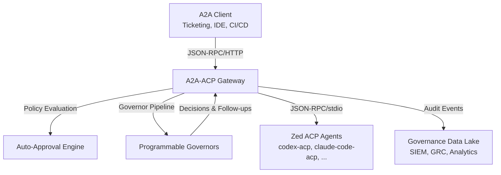

# A2A-ACP Enterprise Whitepaper  
**Governed Agent-to-Agent Workflows for Auditable Software Delivery**

---

## Executive Summary

Organizations are accelerating software delivery by pairing development teams with autonomous coding agents. Yet most editor-first agents (e.g., `codex-acp`, `claude-code-acp`, `gemini-cli`) operate outside the visibility, policy, and auditing controls that enterprise engineering leaders require. A2A-ACP bridges this gap by exposing Zed ACP agents through the Agent-to-Agent (A2A) protocol, embedding fine-grained governance, auto-approval policies, and immutable audit trails into every interaction.

A2A-ACP enables:
- **Policy-driven automation**: Declarative allow/deny decisions keep low-risk tasks moving without human intervention.
- **Programmable oversight**: Scripted, Python, or HTTP governors review proposed edits, inject follow-up prompts, or block unsafe responses with explainable rationale.
- **Complete verifiability**: Structured event streams and audit endpoints supply compliance, legal, and security teams with definitive evidence of “who approved what and why.”

The result is a governed execution fabric where ACP agents become first-class, compliant participants in enterprise workflows.

---

## Architecture Overview

### High-Level Flow



1. **Clients** send A2A JSON-RPC requests to the gateway.
2. **Auto-approval policies** opportunistically approve or deny tool calls.
3. **Governors** review remaining approvals and agent outputs.
4. **Zed ACP agents** execute tool calls inside their native runtime.
5. **Audit events** flow to downstream systems for visibility and compliance.

### Control Surfaces

| Layer | Purpose | Key Controls |
|-------|---------|--------------|
| Auto-Approval Engine | Declarative allow/deny decisions | Path globbing, tool ID filters, parameter constraints, timetable rules |
| Governor Pipeline | Programmable oversight | Script/Python/HTTP targets, stop-on-reject, scoring, metadata propagation |
| Audit Layer | Evidence and traceability | Structured decision logs, follow-up prompts, task history with rationale |

---

## Configuration Deep Dive

A2A-ACP is configured primarily through environment variables plus YAML descriptors for policies and governors.

### Core Environment Variables

| Variable | Purpose | Notes |
|----------|---------|-------|
| `A2A_AGENT_COMMAND` | Absolute path to the ACP agent binary | Required |
| `A2A_AGENT_API_KEY` | Secrets for target agent (if needed) | Optional |
| `A2A_AUTH_TOKEN` | Bearer token for A2A-ACP API authentication | Optional but recommended |
| `A2A_GOVERNORS_FILE` | Path to `governors.yaml` | Enables programmable oversight |
| `A2A_AUTO_APPROVAL_FILE` | Path to `auto_approval_policies.yaml` | Enables declarative decisions |
| `LOG_LEVEL`, `PORT`, `HOST` | Runtime controls | Default to `INFO`, `8000`, `0.0.0.0` |

### Auto-Approval Policies (`auto_approval_policies.yaml`)

```yaml
auto_approval_policies:
  - id: docs-edits
    applies_to: ["functions.acp_fs__write_text_file"]
    include_paths: ["docs/**", "*.md"]
    decision:
      type: approve
      optionId: approved
      reason: "Documentation edits auto-approved"

  - id: safe-shell
    applies_to: ["functions.shell"]
    parameters:
      command_prefix: ["git", "status"]
    decision:
      type: approve
      optionId: approved
      skipGovernors: true
```

- **`applies_to`**: tool IDs or families.
- **`include_paths` / `exclude_paths`**: glob patterns for file-sensitive tools.
- **`parameters`**: JSON path matches on tool parameters.
- **`skipGovernors`**: bypass downstream governors when risk is negligible.

### Governor Pipeline (`governors.yaml`)

```yaml
permission_governors:
  - id: security-diff-check
    type: script
    command: ["python3", "governors/security_diff.py"]
    timeout_ms: 5000

  - id: compliance-http
    type: http
    url: https://governor.example.com/permission
    headers:
      Authorization: Bearer ${GOVERNOR_TOKEN}

output_governors:
  - id: code-reviewer
    type: python
    command: ["python3", "governors/review.py"]
    timeout_ms: 8000
    requires_manual: false

permission_settings:
  stop_on_first_reject: true
  auto_decision: all_approve

output_settings:
  max_iterations: 3
```

Governors receive a canonical JSON payload and return structured responses:

```json
{
  "status": "needs_attention",
  "messages": ["Diff touches payment code. Please add reviewer comments."],
  "followUpPrompt": "Provide unit test coverage for PaymentService.",
  "metadata": {"riskScore": 0.65}
}
```

Return values drive automatic approvals, rejections, or injected follow-up prompts without human intervention.

---

## Enterprise Use Cases

### 1. Regulated Industries

Financial services, healthcare, and critical infrastructure firms require full traceability of coding changes. With A2A-ACP:
- **Auto-approval rules** fast-track low-risk tasks (documentation, test updates).
- **Security governors** run static diff checks or secrets scanners before allowing write operations.
- **Compliance governors** block risky actions and document why decisions were made.
- **Audit endpoints** provide forensic evidence for external auditors.

### 2. Multi-Tenant Platform Teams

Platform organizations operating shared agent pools can:
- Standardize enforcement of coding standards, commit hygiene, and change management.
- Partition governance logic per tenant by pointing each integration at a scoped YAML file.
- Stream `task_governor_followup` events into tenant-specific dashboards.

### 3. CI/CD Automation with Explainability

In pipeline-driven environments:
- Codex agents perform code transformations inside governed lanes.
- Governors trigger follow-up prompts when integration tests are missing, ensuring corrective actions remain inside the automated flow.
- Artifacts (diffs, logs, approvals) are emitted via SSE/webhook for release managers to review.

---

## Compliance & Audit Trail

Every tool permission request, governor decision, and post-run review is recorded. Teams can query:

```bash
curl -H "Authorization: Bearer $TOKEN" \
     http://localhost:8001/a2a/tasks/TASK_ID/governor/history
```

Sample response:

```json
{
  "permissionDecisions": [
    {
      "toolCallId": "call_123",
      "source": "policy:docs-edits",
      "optionId": "approved",
      "governorsInvolved": [],
      "timestamp": "2024-01-18T02:34:56Z",
      "metadata": {"summary": ["Auto-approved documentation edit"]}
    }
  ],
  "pendingPermissions": [],
  "governorFeedback": [
    {
      "phase": "post_run",
      "timestamp": "2024-01-18T02:35:12Z",
      "summary": ["[code-reviewer] Needs attention: add integration tests"],
      "results": [
        {
          "governorId": "code-reviewer",
          "status": "needs_attention",
          "messages": ["Add coverage for error handling."],
          "followUpPrompt": "Please include integration tests covering 500 errors."
        }
      ]
    }
  ]
}
```

This structured history plugs into SIEM, GRC, and analytics systems, satisfying internal and regulatory audit requirements.

---

## Deployment Considerations

- **Scalability**: FastAPI + uvicorn handle horizontally scaled deployments behind load balancers; each pod manages its own ACP subprocesses.
- **Isolation**: Governors can be executed in sandboxed containers to enforce strict resource limits or network egress controls.
- **Secrets Management**: Environment variables for API keys and tokens can be sourced from vaults (AWS Secrets Manager, HashiCorp Vault, etc.).
- **Observability**: Built-in metrics endpoints (`/metrics/push-notifications`, `/metrics/system`) feed into Prometheus/Grafana dashboards.

---

## Enterprise Differentiators

1. **Explainable Automation** – Every decision (auto-approve, governor override, human intervention) is logged with contextual metadata.
2. **Programmable Compliance** – Enterprises can encode legal, security, and policy requirements as code, not manuals.
3. **Agent-Agnostic** – Works with any Zed ACP agent, making ACP ecosystems consumable by higher-level A2A platforms.
4. **Non-Intrusive Adoption** – Requires no modifications to existing ACP agents; governance sits entirely at the A2A boundary.
5. **Future-Proof Protocols** – A2A v0.3.0 compliance ensures interoperability with emerging ecosystem tooling.

---

## Conclusion

A2A-ACP provides the missing layer for enterprises to adopt autonomous coding agents responsibly. By combining protocol translation with governance, auto-approval, and auditability, platform teams can deliver faster while maintaining verifiable control. ACP agents become reliable collaborators—every action approved, every decision explainable, every workflow compliant.

For implementation details, explore:
- [**Configuration Guide**](user-docs/configuration.md)
- [**Governance Events**](user-docs/events.md)
- [**API Reference**](user-docs/api-methods.md)
