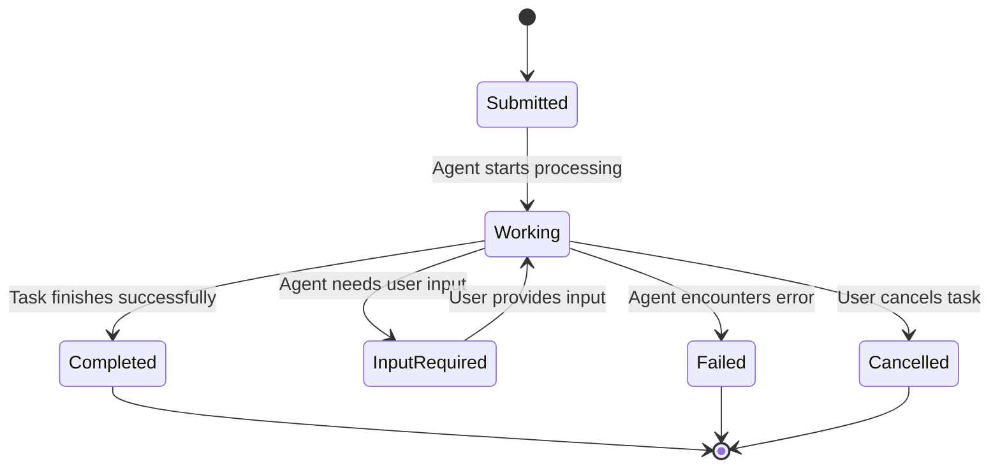

# Architecture Overview

Understand how A2A-ACP bridges Zed ACP agents to the A2A protocol.

## System Architecture

```
┌─────────────────┐    ┌──────────────────┐    ┌─────────────────┐
│   A2A Client    │    │  A2A-ACP Server  │    │   Zed ACP Agent │
│                 │◄──►│   (This Project) │◄──►│   (codex-acp)   │
│ • JSON-RPC/HTTP │    │                  │    │                 │
│ • Tasks         │    │ • Protocol Bridge│    │ • JSON-RPC/stdio│
│ • Agent Cards   │    │ • Task Manager   │    │ • Sessions      │
│ • Discovery     │    │ • Tool Executor  │    │ • Tool Calls    │
│ • Streaming     │    │ • Agent Manager  │    │ • initialize    │
└─────────────────┘    └──────────────────┘    └─────────────────┘
         │                       │                       │
         ▼                       ▼                       ▼
┌─────────────────┐    ┌──────────────────┐    ┌─────────────────┐
│   Tool Config   │    │   Sandbox &      │    │   Audit Logs    │
│   (YAML-based)  │    │   Security       │    │   (Compliance)  │
└─────────────────┘    └──────────────────┘    └─────────────────┘
```

## Core Components

### 1. A2A Protocol Server (`src/a2a_acp/main.py`)

**Responsibility**: HTTP server implementing A2A v0.3.0 JSON-RPC 2.0 specification

**Key Features**:
- **JSON-RPC 2.0 Compliance**: Full implementation of JSON-RPC 2.0 over HTTP
- **Method Routing**: Routes A2A methods to appropriate handlers
- **Authentication**: Bearer token and API key authentication
- **Request Validation**: Comprehensive request validation and sanitization
- **Agent Discovery**: Well-known HTTP endpoint for capability advertisement

### 2. Protocol Translator (`src/a2a/translator.py`)

**Responsibility**: Bidirectional translation between A2A and Zed ACP protocols

**Translation Mapping**:
- **A2A `message/send`** ↔ **Zed ACP `session/prompt`**
- **A2A `tasks/*`** ↔ **Zed ACP session management**
- **A2A contexts** ↔ **Zed ACP sessions**
- **A2A message parts** ↔ **Zed ACP content blocks**

### 3. Task Manager (`src/a2a_acp/task_manager.py`)

**Responsibility**: A2A-native task lifecycle management

**Features**:
- **Task States**: submitted → working → completed/cancelled/failed
- **Context Management**: Stateful conversation persistence
- **Input-Required Workflows**: Multi-turn conversations with pause/resume
- **Event Emission**: Real-time task status notifications, input-required events, message events

### 4. Zed ACP Agent Manager (`src/a2a_acp/zed_agent.py`)

**Responsibility**: Subprocess management for Zed ACP agents

**Features**:
- **Agent Lifecycle**: Launch, monitor, and cleanup Zed ACP subprocesses
- **Environment Injection**: Secure credential and configuration injection
- **Protocol Compliance**: Maintains Zed ACP JSON-RPC stdio communication
- **Error Handling**: Robust error handling and recovery

### 5. Push Notification Manager (`src/a2a_acp/push_notification_manager.py`)

**Responsibility**: HTTP webhook notifications for task events

**Features**:
- **Webhook Delivery**: HTTP POST notifications to configured endpoints
- **Event Filtering**: Sophisticated filtering by event type and time
- **Retry Logic**: Exponential backoff for failed deliveries
- **Analytics**: Delivery success tracking and performance metrics

### 6. Tool Configuration Manager (`src/a2a_acp/tool_config.py`)

**Responsibility**: YAML-based tool definition loading and validation

**Features**:
- **Tool Discovery**: Load and validate tool configurations from YAML files
- **Parameter Validation**: Type checking and required parameter validation
- **Hot Reload**: Runtime configuration updates without restart
- **Schema Validation**: Comprehensive tool definition schema validation

### 7. Bash Tool Executor (`src/a2a_acp/bash_executor.py`)

**Responsibility**: Execute bash scripts with security controls and event emission

**Features**:
- **Script Execution**: Subprocess-based bash script execution
- **Template Rendering**: Jinja2-style parameter substitution
- **Environment Management**: Secure environment variable injection
- **Error Handling**: Comprehensive error classification and recovery
- **Performance Optimization**: Response caching and batch processing
- **Event Emission**: Tool execution events (started, completed, failed) with timing and result data

### 8. Sandbox Manager (`src/a2a_acp/sandbox.py`)

**Responsibility**: User-configured execution environments with security controls

**Features**:
- **Working Directory Management**: Isolated execution directories per tool
- **Command Allowlisting**: Restrict allowed commands for security
- **Resource Limits**: CPU, memory, and execution time limits
- **Network Controls**: Configurable network access restrictions

### 9. Audit Logger (`src/a2a_acp/audit.py`)

**Responsibility**: Comprehensive audit logging for security and compliance

**Features**:
- **Security Events**: Log all tool executions and permission requests
- **Compliance Reporting**: Structured audit trails for regulatory compliance
- **SQLite Backend**: Efficient local audit storage with search capabilities
- **Event Correlation**: Link related events across tool executions
- **Security Event Emission**: High-priority security events for immediate alerting

## Data Flow

### Message Processing Flow

```
1. A2A Client Request
       ↓
2. Protocol Validation
       ↓
3. Task Creation/Update
       ↓
4. Protocol Translation (A2A → Zed ACP)
       ↓
5. Zed ACP Agent Execution
   (may include tool calls)
       ↓
6. Tool Execution (if requested)
   • Script template rendering
   • Sandbox environment setup
   • Bash script execution
   • Security controls
   • Audit logging
       ↓
7. Protocol Translation (Zed ACP → A2A)
       ↓
8. Task Update & Event Emission
       ↓
9. Response to Client
```

### Task Lifecycle



## Database Schema

### Core Tables

**`tasks`**: A2A task information
```sql
CREATE TABLE tasks (
    id TEXT PRIMARY KEY,
    context_id TEXT,
    status TEXT NOT NULL,
    status_timestamp TEXT,
    metadata TEXT,  -- JSON
    created_at DATETIME DEFAULT CURRENT_TIMESTAMP
);
```

**`messages`**: Message history and parts
```sql
CREATE TABLE messages (
    id TEXT PRIMARY KEY,
    task_id TEXT REFERENCES tasks(id),
    role TEXT NOT NULL,
    parts TEXT NOT NULL,  -- JSON array
    message_id TEXT,
    context_id TEXT,
    created_at DATETIME DEFAULT CURRENT_TIMESTAMP
);
```

**`contexts`**: Conversation context management
```sql
CREATE TABLE contexts (
    id TEXT PRIMARY KEY,
    metadata TEXT,  -- JSON
    created_at DATETIME DEFAULT CURRENT_TIMESTAMP,
    last_activity DATETIME DEFAULT CURRENT_TIMESTAMP
);
```

## Protocol Compliance

### A2A v0.3.0 Compliance

**Core Methods**:
- ✅ `message/send` - Message sending and task creation
- ✅ `message/stream` - Streaming message support
- ✅ `tasks/get` - Task retrieval with history
- ✅ `tasks/list` - Task listing with filtering
- ✅ `tasks/cancel` - Task cancellation
- ✅ `agent/getAuthenticatedExtendedCard` - Agent capability advertisement

**Discovery**:
- ✅ `/.well-known/agent-card.json` - HTTP endpoint for agent discovery

**Advanced Features**:
- ✅ **Input-Required Workflows**: Multi-turn conversations with state management
- ✅ **Context Persistence**: Conversation continuity across tasks
- ✅ **Push Notifications**: HTTP webhook notifications
- ✅ **Streaming Support**: Server-Sent Events for real-time updates
- ✅ **Tool Execution**: Bash-based tool execution with security sandboxing

### Zed ACP Compliance

**Core Protocol**:
- ✅ **JSON-RPC 2.0 over stdio**: Proper stdio communication
- ✅ **Session Management**: Session lifecycle and persistence
- ✅ **Content Blocks**: Translation to/from A2A message parts
- ✅ **Streaming Responses**: Real-time response handling
- ✅ **Tool Calls**: Comprehensive tool execution with bash script support

## Security Architecture

### Authentication Layers

1. **Transport Security**: TLS/HTTPS for all communications
2. **API Authentication**: Bearer tokens or API keys
3. **Agent Security**: Secure credential injection for Zed ACP agents
4. **Request Validation**: Comprehensive input validation and sanitization

### Isolation Model

- **Process Isolation**: Zed ACP agents run as separate subprocesses
- **Network Isolation**: Controlled network access for agents and tools
- **File System Isolation**: Configurable working directories per tool
- **Command Allowlisting**: Restrict allowed commands per tool for security
- **Environment Isolation**: Secure environment variable injection per tool

### Process Security Limits

Every tool execution is protected by **hard OS-level limits** via `setrlimit()`:

| Limit Type | Default Value | Description |
|------------|---------------|-------------|
| **Memory Usage** | 512 MB | Maximum RAM per tool execution |
| **CPU Time** | 30 seconds | Maximum execution time per tool |
| **File Size** | 10 MB | Maximum size of output files |
| **Open Files** | 100 files | Maximum number of open file descriptors |
| **Child Processes** | 10 processes | Maximum number of child processes |

**These limits are enforced at the OS level and cannot be overridden.**

## Performance Architecture

### Async Architecture

- **AsyncIO Throughout**: Non-blocking I/O for scalability
- **Connection Pooling**: Efficient database connection management
- **Task Queues**: Background processing for notifications
- **Streaming Support**: Memory-efficient real-time responses

### Caching Strategy

- **Tool Response Caching**: Tool execution result caching with TTL-based invalidation
- **Session Caching**: Zed ACP session state optimization
- **Configuration Caching**: Hot-reload of configuration changes
- **Cache Invalidation**: Automatic cache cleanup when tool versions change

## Deployment Architecture

### Single-Agent Deployment (Recommended)

```
┌─────────────────┐    ┌──────────────────┐
│   Load Balancer │    │  A2A-ACP Server  │
│   (nginx)       │◄──►│  + Zed ACP Agent │
│                 │    │                  │
└─────────────────┘    └──────────────────┘
```

**Benefits**:
- Simple configuration and deployment
- Clear A2A AgentCard mapping
- Easier debugging and monitoring
- Better resource utilization

### Multi-Agent Deployment (Advanced)

```
┌─────────────────┐    ┌──────────────────┐
│   API Gateway   │    │  A2A-ACP #1      │
│   Route by Auth │◄──►│  + codex-acp     │
│   Token         │    ├──────────────────┤
└─────────────────┘    │  A2A-ACP #2      │
                       │  + claude-acp    │
                       └──────────────────┘
```

## Development Architecture

### Project Structure

```
a2a-acp/
├── src/
│   ├── a2a/           # A2A Protocol Implementation (Essential Components)
│   │   ├── models.py     # A2A type definitions (shared)
│   │   └── translator.py # Protocol translation (shared)
│   └── a2a_acp/       # A2A-ACP Application
│       ├── main.py    # FastAPI application with A2A JSON-RPC server
│       ├── task_manager.py # Task lifecycle management
│       ├── zed_agent.py # Zed ACP subprocess management
│       ├── tool_config.py # Tool configuration and validation
│       ├── bash_executor.py # Bash script execution engine
│       ├── sandbox.py # Execution environment management
│       └── audit.py # Security audit logging
├── tests/             # 240+ comprehensive tests
│   ├── test_tool_config.py # Tool configuration tests
│   ├── test_tool_protocol_compliance.py # Protocol compliance tests
│   └── test_tool_system_integration.py # End-to-end integration tests
├── tools.yaml         # Tool definitions and configurations
└── user-docs/         # Comprehensive documentation
```

### Testing Architecture

- **Unit Tests**: Individual component testing
- **Integration Tests**: End-to-end protocol compliance
- **Protocol Tests**: A2A and Zed ACP compliance verification
- **Performance Tests**: Load testing and benchmarking

---

**Architecture understood!** 🏗️ Next: [API Methods](api-methods.md) for implementation details.