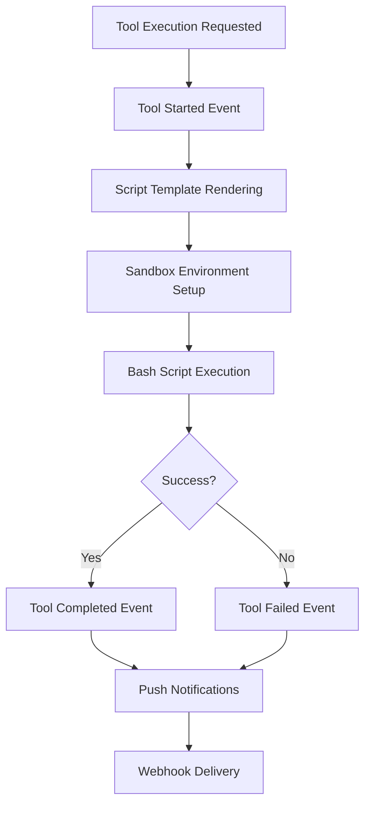

# Tool Execution System

A2A-ACP includes a powerful **bash-based tool execution system** that enables Zed ACP agents to execute bash scripts with unlimited flexibility while maintaining enterprise-grade security. The same framework now powers **Codex tool calls** for `fs/read_text_file`, `fs/write_text_file`, and `shell`, so Codex CLI sessions can interact with the workspace through A2A-ACP without extra adapters. Additional Codex tools (such as `apply_patch` or multi-edit helpers) will be wired up in future iterations.

## Overview

The tool execution system transforms A2A-ACP from a **protocol bridge** into a **full-featured agent environment** where agents can:

- **Execute HTTP API calls** via curl commands
- **Query databases** using psql, mysql, sqlite3 clients
- **Process files** with find, grep, awk, sed tools
- **Manage systems** using systemctl, docker, git commands
- **Run custom scripts** combining any of the above

## Architecture

```
┌─────────────────┐    ┌──────────────────┐    ┌─────────────────┐
│   ZedACP Agent  │───▶│  Tool Interceptor│───▶│  Bash Executor  │
│   (Tool Calls)  │    │  (Route & Auth)  │    │  (Safe Execute) │
└─────────────────┘    └──────────────────┘    └─────────────────┘
          │                       │                       │
          ▼                       ▼                       ▼
┌─────────────────┐    ┌──────────────────┐    ┌─────────────────┐
│   A2A Events    │    │   Tool Config    │    │   Audit Logs    │
│   (Emitted)     │    │   (YAML-based)   │    │   (Security)    │
└─────────────────┘    └──────────────────┘    └─────────────────┘
```

## Tool Definition

Tools are defined in YAML configuration files with bash script templates:

```yaml
# tools.yaml
tools:
  web_request:
    name: "HTTP Request"
    description: "Execute HTTP requests via curl"
    script: |
      #!/bin/bash
      curl -X {{method}} "{{url}}" \
           -H "Content-Type: application/json" \
           {{#headers}} -H "{{key}}: {{value}}" {{/headers}} \
           {{#data}} -d '{{data}}' {{/data}} \
           -w "STATUS:%{http_code}\n" \
           --max-time {{timeout|default(30)}}
    parameters:
      - name: method
        type: string
        required: true
        description: "HTTP method (GET, POST, etc.)"
      - name: url
        type: string
        required: true
        description: "Target URL"
      - name: headers
        type: object
        required: false
        description: "HTTP headers as key-value pairs"
      - name: data
        type: string
        required: false
        description: "Request body data"
      - name: timeout
        type: number
        required: false
        description: "Timeout in seconds"
        default: 30
    sandbox:
      requires_confirmation: false
      timeout: 30
      working_directory: "/tmp"
      use_temp_isolation: true  # Creates isolated temp subdirectory for execution
      environment_variables:
        API_KEY: "sk-1234567890abcdef"
        BASE_URL: "https://api.example.com/v1"
      # Optional: Custom resource limits (defaults shown below)
      # max_memory_mb: 512         # Max memory in MB
      # max_cpu_time_seconds: 30   # Max CPU time in seconds
      # max_file_size_mb: 10       # Max output file size in MB
      # max_open_files: 100        # Max open file descriptors
      # max_processes: 10          # Max child processes
```

## Sandboxing & Security

### User-Configured Environments

Each tool author configures their own execution environment:

```bash
# Database tool with PostgreSQL client
export PGHOST=localhost
export PGDATABASE=myapp
export PGUSER=tool_user
export PGPASSWORD=secret

# Web API tool with API keys
export API_KEY=sk-1234567890abcdef
export BASE_URL=https://api.example.com/v1

# File processing tool with working directory
cd /tmp/safe-workspace
export TMPDIR=/tmp/safe-workspace
```

### Security Controls

- **Command Allowlisting**: Restrict allowed commands per tool
- **Working Directory Isolation**: Each tool runs in its designated workspace
- **Environment Variable Injection**: Secure credential management
- **Timeout Enforcement**: Prevent runaway processes (configurable per tool, default 30s)
- **Input Validation**: Parameter sanitization and type checking

### Optional Temporary Isolation

To prevent accumulation of empty temporary directories (especially for simple filesystem tools like read/write operations), the sandbox supports optional temporary isolation:

- **use_temp_isolation: true** (default for risky tools like `shell`): Creates a unique temporary subdirectory in the configured `working_directory` for each execution. This provides strong isolation but can leave empty directories if cleanup fails. The system automatically cleans up via the `managed_sandbox` context manager.
- **use_temp_isolation: false** (recommended for low-risk filesystem tools): Executes directly in the configured `working_directory` without creating temp subdirectories. Security is maintained via `allowed_paths` (e.g., `["."]` for project root access) and script validation. This avoids empty directory buildup.

Example for a filesystem tool:

```yaml
functions.acp_fs__read_text_file:
  name: "Read Text File"
  description: "Read text from a file"
  script: |
    #!/bin/bash
    cat "{{path}}"
  parameters:
    - name: path
      type: string
      required: true
      description: "File path to read"
  sandbox:
    requires_confirmation: false
    timeout: 10
    working_directory: "."  # Project root
    use_temp_isolation: false  # Direct execution, no temp dir created
    allowed_paths: ["."]  # Restrict to project root
```

**Benefits**:
- **No Empty Dirs**: Filesystem tools like `read_text_file` and `write_text_file` execute without temp overhead.
- **Cleanup Guarantee**: Isolated tools (e.g., `shell`) use context managers for automatic cleanup.
- **Security Balance**: Non-isolated tools still undergo script validation and path restrictions.

### Process-Level Security Limits

Every tool execution is automatically protected by **hard process limits** via `setrlimit()` system calls:

| Limit Type | Default Value | Description |
|------------|---------------|-------------|
| **Memory Usage** | 512 MB | Maximum RAM per tool execution |
| **CPU Time** | 30 seconds | Maximum execution time per tool |
| **File Size** | 10 MB | Maximum size of output files |
| **Open Files** | 100 files | Maximum number of open file descriptors |
| **Child Processes** | 10 processes | Maximum number of child processes |

**These limits can be customized per tool** using the `resource_limits` section in tool configuration:

```yaml
# tools.yaml
tools:
  data_processor:
    name: "Data Processor"
    description: "Process large datasets"
    script: "python process_data.py {{input_file}}"
    sandbox:
      # Custom resource limits for this tool
      max_memory_mb: 1024        # More memory for data processing
      max_cpu_time_seconds: 300  # 5 minutes for complex processing
      max_file_size_mb: 100      # Larger output files allowed
      max_open_files: 200        # More file handles for batch processing
      max_processes: 5           # Allow multiple worker processes
    parameters:
      - name: input_file
        type: string
        required: true
        description: "Input data file"

  quick_task:
    name: "Quick Task"
    description: "Fast, simple operations"
    script: "echo {{message}}"
    sandbox:
      # Conservative limits for simple tasks
      max_memory_mb: 128         # Less memory needed
      max_cpu_time_seconds: 10   # Quick operations only
      max_file_size_mb: 1        # Small outputs
      max_open_files: 10         # Minimal file access
      max_processes: 1           # Single process only
    parameters:
      - name: message
        type: string
        required: true
        description: "Message to echo"
```

**Resource Limit Guidelines**:

- **Memory**: Set based on expected data sizes (default: 512MB)
- **CPU Time**: Set based on operation complexity (default: 30s)
- **File Size**: Set based on expected output sizes (default: 10MB)
- **Open Files**: Set based on file operations needed (default: 100)
- **Processes**: Set based on parallelism requirements (default: 10)

**Note**: These limits provide **defense-in-depth** security - they work even if other security measures fail.

## Template Processing

Tools use **Jinja2-style templates** for dynamic script generation:

```bash
# Template with conditional logic
SCRIPT_TEMPLATE = """
#!/bin/bash
curl -X {{method|default('GET')}} \
     "{{url}}" \
     {{#headers}} -H "{{key}}: {{value}}" {{/headers}} \
     {{#data}} -d '{{data|tojson}}' {{/data}} \
     -H "Authorization: Bearer {{auth_token}}" \
     -w "HTTPSTATUS:%{http_code}"
"""

# Rendered script
rendered_script = """
#!/bin/bash
curl -X POST \
     "https://api.example.com/users" \
     -H "Content-Type: application/json" \
     -d '{"name": "John", "email": "john@example.com"}' \
     -H "Authorization: Bearer abc123" \
     -w "HTTPSTATUS:%{http_code}"
"""
```

## Example Tools

### HTTP Request Tool

```yaml
web_request:
  name: "HTTP Request"
  description: "Execute HTTP requests via curl"
  script: |
    curl -X {{method}} "{{url}}" \
         -H "Content-Type: application/json" \
         {{#headers}} -H "{{key}}: {{value}}" {{/headers}} \
         {{#data}} -d '{{data}}' {{/data}}
  parameters:
    - name: method
      type: string
      required: true
      description: "HTTP method"
    - name: url
      type: string
      required: true
      description: "Target URL"
```

**Usage:**
```bash
# Agent executes: web_request with {"method": "POST", "url": "https://api.example.com/data"}
# Result: HTTP response from the API call
```

**Resource Limits Example:**
```yaml
web_request_heavy:
  name: "Heavy HTTP Request"
  description: "HTTP requests with custom resource limits"
  script: |
    curl -X {{method}} "{{url}}" \
         {{#data}} -d '{{data}}' {{/data}} \
         --max-time {{timeout|default(30)}}
  sandbox:
    # Custom limits for API tools that need more time
    max_memory_mb: 256           # Less memory for simple HTTP
    max_cpu_time_seconds: 60     # More time for slow APIs
    max_file_size_mb: 50         # Larger response handling
    timeout: 60                  # Match CPU limit
  parameters:
    - name: method
      type: string
      required: true
      description: "HTTP method"
    - name: url
      type: string
      required: true
      description: "Target URL"
    - name: data
      type: string
      required: false
      description: "Request body data"
```

### Database Query Tool

```yaml
database_query:
  name: "Database Query"
  description: "Execute SQL queries"
  script: |
    psql -h {{host}} -d {{database}} -U {{user}} \
         -c "{{query}}" --csv
  parameters:
    - name: host
      type: string
      required: true
      description: "Database host"
    - name: database
      type: string
      required: true
      description: "Database name"
    - name: query
      type: string
      required: true
      description: "SQL query"
```

**Usage:**
```bash
# Agent executes: database_query with {"query": "SELECT * FROM users WHERE active = true"}
# Result: CSV output from PostgreSQL query
```

### File Processing Tool

```yaml
file_processor:
  name: "File Processor"
  description: "Process files with grep and find"
  script: |
    find {{directory}} -name "{{pattern}}" \
         -exec grep -l "{{search}}" {} \; \
         | head -{{limit}}
  parameters:
    - name: directory
      type: string
      required: true
      description: "Search directory"
    - name: pattern
      type: string
      required: true
      description: "File pattern"
    - name: search
      type: string
      required: true
      description: "Text to search for"
```

**Usage:**
```bash
# Agent executes: file_processor with {"pattern": "*.py", "search": "TODO"}
# Result: List of Python files containing "TODO"
```

## Confirmation Workflows

Sensitive tools can require user confirmation:

```yaml
dangerous_operation:
  name: "Dangerous Operation"
  description: "Performs a sensitive operation"
  script: "dangerous_command --execute"
  sandbox:
    requires_confirmation: true
    confirmation_message: "This operation cannot be undone. Proceed?"
  parameters: []
```

When executed, the system:
1. **Pauses execution** and emits `input-required` event
2. **Waits for user confirmation** via A2A protocol
3. **Continues execution** only if user confirms
4. **Cancels gracefully** if user declines

## Error Handling

### Retry Logic

Tools support configurable retry strategies:

```yaml
unreliable_tool:
  name: "Unreliable Tool"
  description: "Tool that may fail occasionally"
  script: "sometimes_fails"
  retry:
    attempts: 3
    backoff: exponential
    backoff_multiplier: 2
    max_delay: 30
```

### Circuit Breaker

Automatic failure detection for consistently failing tools:

```yaml
flaky_api:
  name: "Flaky API"
  description: "External API that may be down"
  script: "curl {{url}}"
  circuit_breaker:
    failure_threshold: 5
    recovery_timeout: 60
    monitoring_period: 30
```

## Performance Features

### Response Caching

Frequently used tools can cache results:

```yaml
cached_api:
  name: "Cached API"
  description: "API with response caching"
  script: "curl {{url}}"
  caching:
    enabled: true
    ttl: 300  # 5 minutes
    max_size: 1000  # 1000 cached responses
    key_template: "{{url}}:{{method}}"
```

### Batch Processing

Execute multiple tools concurrently:

```python
# Execute multiple tools in parallel
results = await bash_executor.execute_batch([
    {"tool": "web_request", "params": {"url": "https://api1.com"}},
    {"tool": "web_request", "params": {"url": "https://api2.com"}},
    {"tool": "database_query", "params": {"query": "SELECT COUNT(*) FROM users"}}
])
```

## Event Emission During Tool Execution

### When Events Are Emitted

**Tool Execution Started**
- **Emitted when**: Tool execution begins in `bash_executor.py`
- **Trigger**: `execute_tool()` method called with tool and parameters
- **Contains**: Tool ID, parameters, execution context, user info

**Tool Execution Completed**
- **Emitted when**: Script execution finishes successfully
- **Trigger**: Bash script returns exit code 0
- **Contains**: Execution time, output length, return code, cached status

**Tool Execution Failed**
- **Emitted when**: Script execution fails or times out
- **Trigger**: Bash script returns non-zero exit code or timeout
- **Contains**: Error message, execution time, retry information

### Event Flow



### Event Structure Details

**Tool Started Event** (from `bash_executor.py`):
```json
{
  "event": "tool_execution",
  "task_id": "task_123",
  "timestamp": "2024-01-15T10:30:00Z",
  "component": "bash_executor",
  "data": {
    "tool_id": "web_request",
    "status": "started",
    "parameters": {"method": "GET", "url": "https://api.example.com"},
    "execution_context": "production"
  }
}
```

**Tool Completed Event** (from `bash_executor.py`):
```json
{
  "event": "tool_execution",
  "task_id": "task_123",
  "timestamp": "2024-01-15T10:30:01Z",
  "component": "bash_executor",
  "data": {
    "tool_id": "web_request",
    "status": "completed",
    "execution_time": 0.5,
    "return_code": 0,
    "output_length": 512,
    "cached": false
  }
}
```

## Integration with A2A Protocol

### Tool Discovery

Tools are automatically advertised via A2A AgentCard skills:

```python
# Each tool becomes an AgentSkill
AgentSkill(
    id=tool.id,
    name=tool.name,
    description=tool.description,
    tags=["bash", "tool"],
    examples=[tool.example_usage]
)
```

### Tool Execution

Zed ACP agents execute tools via standard tool calls:

```json
{
  "toolCalls": [
    {
      "id": "call_123",
      "toolId": "web_request",
      "parameters": {
        "method": "GET",
        "url": "https://api.example.com/data"
      }
    }
  ]
}
```

## Best Practices

### Tool Development

1. **Start Simple**: Begin with basic functionality, add complexity as needed
2. **Error Handling**: Include proper error checking in bash scripts
3. **Output Format**: Structure output for easy parsing by agents
4. **Documentation**: Provide clear parameter descriptions and examples

### Security

1. **Principle of Least Privilege**: Only request necessary permissions
2. **Input Validation**: Validate all parameters before use
3. **Secure Defaults**: Use safe defaults for timeouts and resource limits
4. **Audit Logging**: Log all executions for security monitoring
5. **Temp Isolation**: Set `use_temp_isolation: false` for low-risk tools to avoid empty directories; use `true` for isolation in risky operations.

### Performance

1. **Efficient Scripts**: Optimize bash scripts for speed
2. **Appropriate Timeouts**: Set reasonable timeouts for operations
3. **Resource Limits**: Configure memory and CPU limits appropriately
4. **Caching Strategy**: Use caching for expensive operations

## Troubleshooting

### Common Issues

**"Permission denied"**
```bash
# Check file permissions
ls -la /path/to/tool/script

# Fix permissions
chmod +x /path/to/tool/script
```

**"Command not found"**
```bash
# Check if required commands are installed
which curl psql find

# Install missing dependencies
apt-get install curl postgresql-client findutils
```

**"Timeout exceeded"**
```bash
# Increase timeout in tool configuration
timeout: 60  # Increase from default 30 seconds

# Or check if operation is actually hanging
ps aux | grep "tool_process"
```

**"Template rendering failed"**
```bash
# Check template syntax
# Ensure all template variables are provided
# Validate parameter types match template expectations
```

**"Empty temporary directories accumulating"**
- Ensure `use_temp_isolation: false` for filesystem tools in `sandbox` config.
- Verify cleanup via `managed_sandbox` context manager for isolated tools.
- Check logs for cleanup errors in `sandbox.py`.

---
**Tool execution configured!** 🛠️ For more examples, see the `tools.yaml` file in the project root.
